# Session 11: Kubernetes Services & Networking

---

## Kubernetes Port Architecture & Packet Flow

Kubernetes services manage internal and external routing using 4 distinct port definitions:

* **`containerPort`**: Port where the application process listens inside the container (e.g., `8080`).
* **`targetPort`**: Port on the Pod that the Service forwards traffic to (e.g., `8080`).
* **`port`**: Virtual port exposed internally by the Kubernetes Service (e.g., `80`).
* **`nodePort`**: Static port allocated on every cluster Node (`30000–32767`) for external access.

```text
External Client ──[ <NodeIP>:30080 ]──► Kubernetes Node (NodePort: 30080)
                                                │
                                                ▼ (kube-proxy)
                                         Service (ClusterIP:80)
                                                │
                                                ▼ (targetPort: 8080)
                                         Pod (containerPort: 8080)
                                                │
                                                ▼
                                         Application Process
```

---

## Type 1 Service — ClusterIP (Default Internal Networking)

`ClusterIP` exposes the service on an internal IP address accessible only within the cluster.

```yaml
apiVersion: v1
kind: Service
metadata:
  name: web-service-clusterip
spec:
  type: ClusterIP
  selector:
    app: web-app-clusterip
  ports:
    - port: 8080
      targetPort: 80
```

```bash
kubectl apply -f 01-clusterip/app-deployment.yaml
kubectl apply -f 01-clusterip/service.yaml
kubectl get svc web-service-clusterip
```

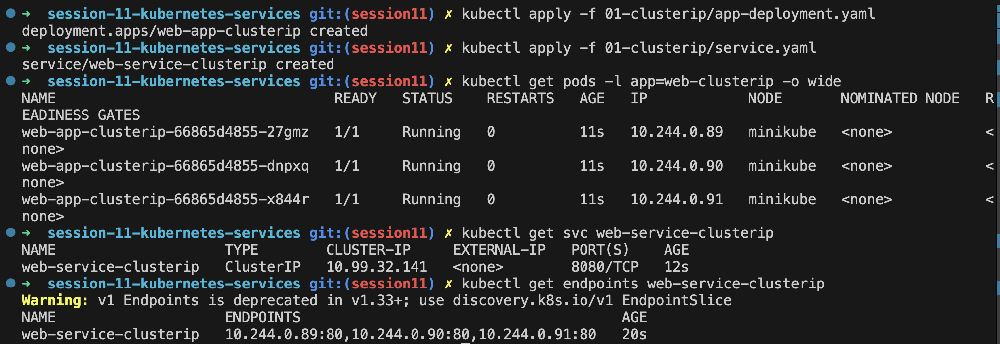

```bash
kubectl apply -f 01-clusterip/client-pod.yaml
kubectl exec -it curl-client -- curl -s http://web-service-clusterip:8080 | grep -i "<title>"
```

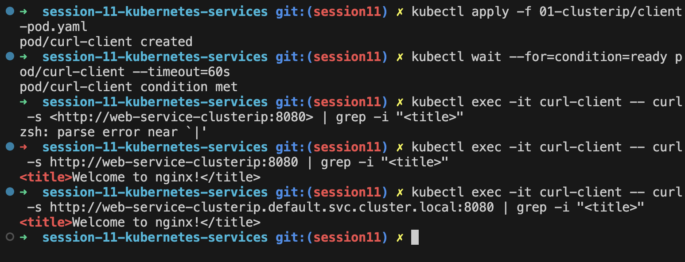

---

## Type 2 Service — NodePort (Host-Level External Ingress)

`NodePort` exposes the service on a static port on each worker Node's IP address.

```yaml
apiVersion: v1
kind: Service
metadata:
  name: web-service-nodeport
spec:
  type: NodePort
  selector:
    app: web-nodeport
  ports:
    - port: 80
      targetPort: 80
      nodePort: 30080
```

```bash
kubectl apply -f 02-nodeport/app-deployment.yaml
kubectl apply -f 02-nodeport/service.yaml
kubectl get svc web-service-nodeport
```

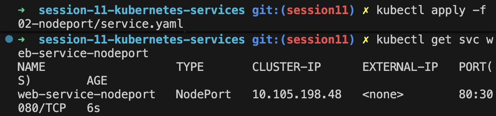

```bash
# Verify external access via NodePort
curl -I http://127.0.0.1:30080
```

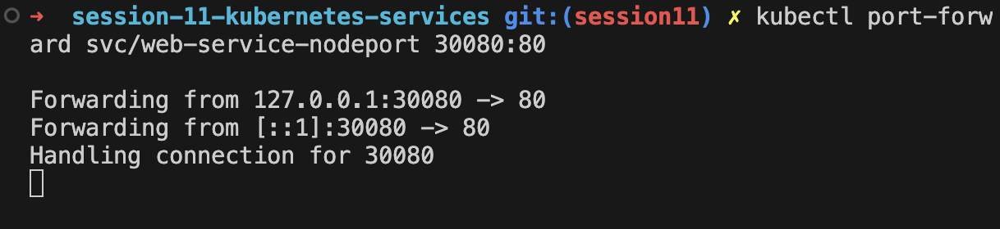

```bash
minikube service web-service-nodeport --url
```

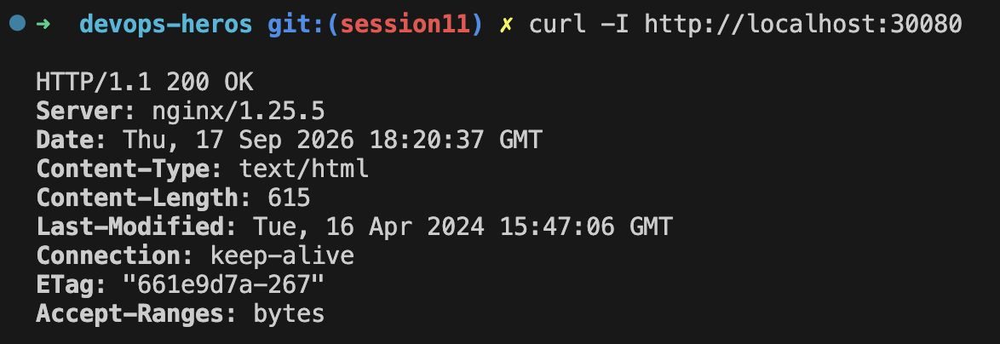

---

## Type 3 Service — LoadBalancer (Cloud-Native Ingress Simulation)

`LoadBalancer` exposes the service externally using a cloud provider's load balancer. In local Minikube environments, `minikube tunnel` allocates an external IP.

```yaml
apiVersion: v1
kind: Service
metadata:
  name: web-service-loadbalancer
spec:
  type: LoadBalancer
  selector:
    app: web-loadbalancer
  ports:
    - port: 80
      targetPort: 80
```

```bash
kubectl apply -f 03-loadbalancer/app-deployment.yaml
kubectl apply -f 03-loadbalancer/service.yaml
```

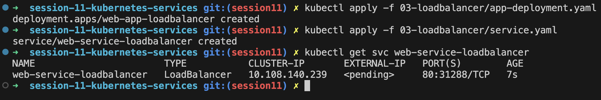

```bash
# In a separate terminal, simulate cloud IP allocation
minikube tunnel
```

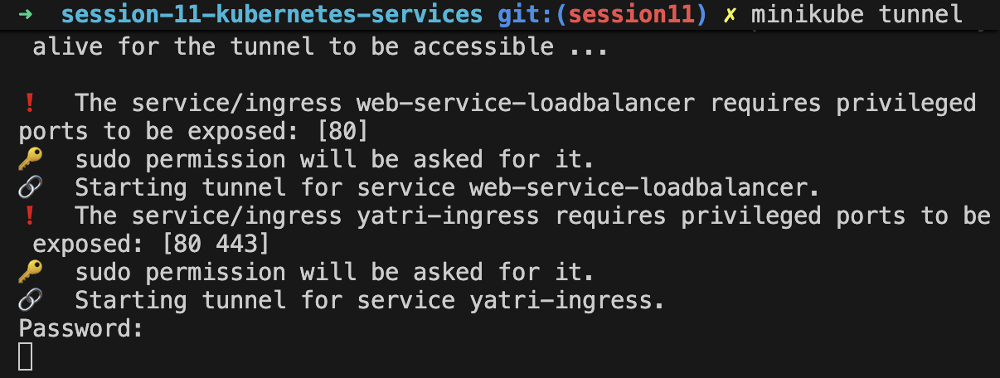

```bash
kubectl get svc web-service-loadbalancer
EXTERNAL_IP=$(kubectl get svc web-service-loadbalancer -o jsonpath='{.status.loadBalancer.ingress[0].ip}')
curl -s http://${EXTERNAL_IP}:80 | grep -i "<title>"
```

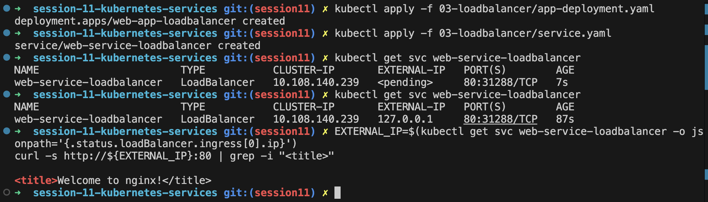

---

## Type 4 Service — ExternalName (CoreDNS CNAME Alias Redirection)

`ExternalName` maps a service to an external DNS domain name (`CNAME` record) without selectors or endpoints.

```yaml
apiVersion: v1
kind: Service
metadata:
  name: external-database-service
spec:
  type: ExternalName
  externalName: api.github.com
```

```bash
kubectl apply -f 04-externalname/service.yaml
kubectl apply -f 04-externalname/client-pod.yaml
kubectl exec -it dns-test-client -- nslookup external-database-service
```

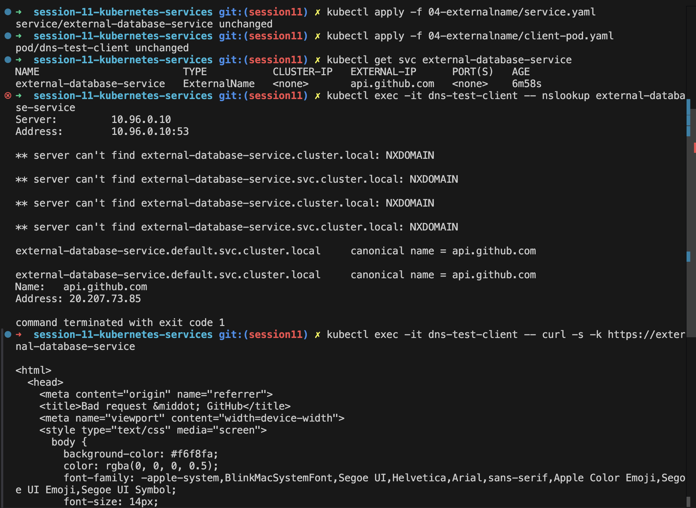

---

## Type 5 Service — Headless Service (`clusterIP: None` & Stateful Workloads)

A Headless Service (`clusterIP: None`) returns individual Pod IPs via DNS instead of allocating a single load-balanced virtual IP.

```yaml
apiVersion: v1
kind: Service
metadata:
  name: headless-service
spec:
  clusterIP: None
  selector:
    app: stateful-app
  ports:
    - port: 80
      name: http
```

```bash
kubectl apply -f 05-headless/service.yaml
kubectl apply -f 05-headless/statefulset.yaml
kubectl exec -it headless-dns-client -- nslookup headless-service
```

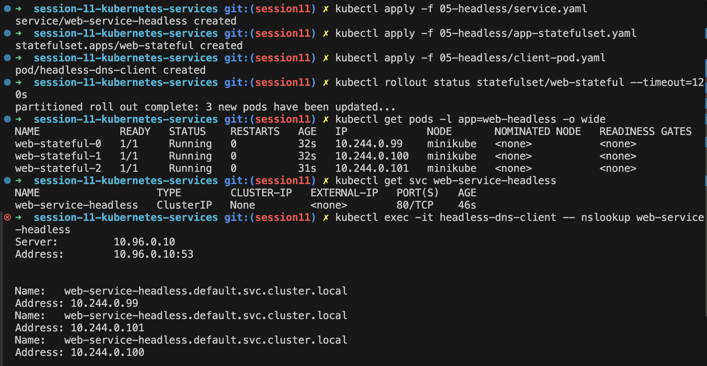

```bash
# Direct ordinal pod addressing
kubectl exec -it headless-dns-client -- nslookup web-stateful-0.headless-service
```

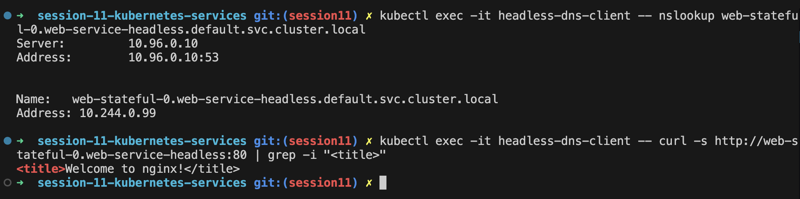

---

## Services Without Selectors (Manual Endpoints Mapping)

Creating a `ClusterIP` service without a label selector allows manually binding custom `Endpoints` to route cluster traffic to external non-Kubernetes databases or legacy IPs.

```yaml
apiVersion: v1
kind: Service
metadata:
  name: external-db
spec:
  ports:
    - port: 5432
---
apiVersion: v1
kind: Endpoints
metadata:
  name: external-db
subsets:
  - addresses:
      - ip: 192.168.1.100
    ports:
      - port: 5432
```

---

## FQDN & CoreDNS Deep Dive Architecture Analysis

Kubernetes pods resolve services via CoreDNS using the Fully Qualified Domain Name (FQDN) syntax: `<service>.<namespace>.svc.cluster.local`.

```bash
kubectl exec -it curl-client -- cat /etc/resolv.conf
```

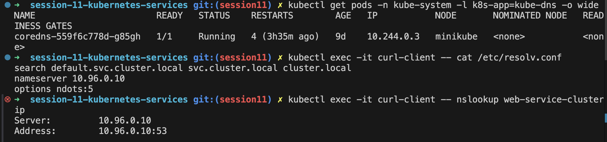

```bash
kubectl exec -it curl-client -- nslookup web-service-clusterip.default.svc.cluster.local
```

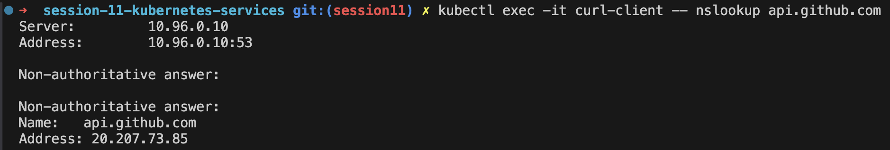

### The `ndots:5` Latency Gotcha

By default, `/etc/resolv.conf` sets `ndots:5`. If a domain name contains fewer than 5 dots, CoreDNS iterates sequentially through search domains (`.default.svc.cluster.local`, `.svc.cluster.local`, `.cluster.local`) before attempting an absolute lookup, which can introduce external lookup latency.

---

## Pod Identity & Lifecycle Invariance Drill — Deployment vs. StatefulSet

Deployments manage interchangeable, stateless pods with random hashes (`app-recreate-7bd8d89b8b-6qtlj`). StatefulSets manage stateful pods with deterministic ordinal indices (`web-stateful-0`).

```bash
kubectl get pods -l app=stateful-app
kubectl delete pod web-stateful-0
```

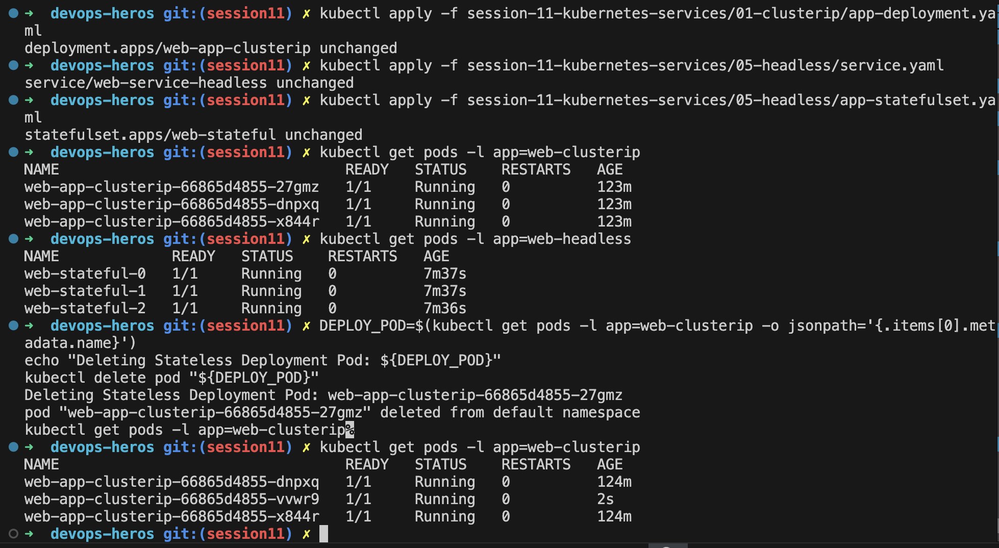

```bash
# Replacement pod recreates with exact same ordinal index and identity (web-stateful-0)
kubectl get pods -l app=stateful-app
```

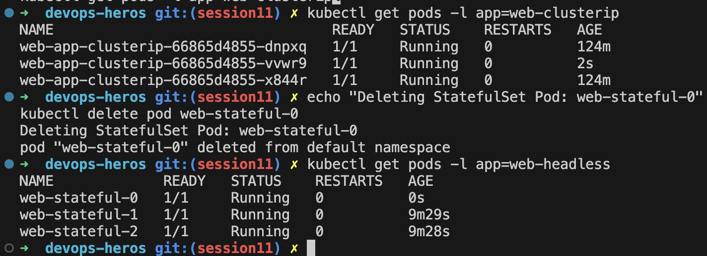

---

## Master Architectural Matrix — Deployment vs. StatefulSet vs. DaemonSet

| Feature | Deployment | StatefulSet | DaemonSet |
| :--- | :--- | :--- | :--- |
| **Purpose** | Stateless applications | Stateful applications | One pod per node |
| **Identity** | Ephemeral (random pod hashes) | Stable ordinal identity (`app-0`, `app-1`) | Node-bound pod identity |
| **Startup Order** | Parallel / unordered | Ordered (`0 → 1 → 2`) | Automatic per node |
| **Shutdown Order** | Unordered | Reverse order (`2 → 1 → 0`) | Node termination / spec removal |
| **Storage (`PVC`)** | Shared volume / No PVC template | `volumeClaimTemplates` (dedicated PVC per pod) | HostPath / No PVC template |
| **Associated Service**| ClusterIP / LoadBalancer | Headless Service (`clusterIP: None`) | ClusterIP / NodePort |
| **Production Use** | Web servers, APIs, microservices | PostgreSQL, MySQL, Kafka, Elasticsearch | Log collectors (Fluentd), node monitoring |

---

## Production Cost Optimization & Service Selection Decision Tree

```text
Need to expose a Kubernetes application?
            │
            ├── Only inside cluster? ──────────────────────► ClusterIP (Default microservices)
            │
            ├── Direct external access?
            │       ├── Dev / Testing ────────────────────► NodePort
            │       └── Single Production App ────────────► LoadBalancer
            │
            └── Multiple HTTP/HTTPS Microservices? ──────► Ingress (Single Cloud Load Balancer)
```

### Production Cost Anti-Pattern vs Recommended Architecture

```text
Anti-Pattern (High Cost 💸):
  Service A ──► Cloud Load Balancer ($20/mo)
  Service B ──► Cloud Load Balancer ($20/mo)
  Service C ──► Cloud Load Balancer ($20/mo)
  (Hundreds of Services = Thousands $/month)

Production Recommended Pattern (Cost Optimized ⚡):
  Internet ──► ONE Cloud Load Balancer ──► Ingress Controller
                                                │
                                    ┌───────────┼───────────┐
                                    ▼           ▼           ▼
                                ClusterIP   ClusterIP   ClusterIP
                                (Service A) (Service B) (Service C)
```

---

## Minikube Docker-Driver Port Binding & Tunnel Analysis

* **Bare-metal Linux**: Worker node IPs are physical network interfaces reachable directly on the local network.
* **macOS / Windows Docker Driver**: Minikube runs inside an isolated Docker container bridge network (`docker0`/`bridge`). The node IP (e.g., `192.168.49.2`) is isolated from host routing tables.

### Workarounds on macOS/Windows

1. **`minikube service <svc> --url`**: Provisions an automated local proxy tunnel.
2. **`minikube tunnel`**: Creates a Layer 3 routing bridge from host `127.0.0.1` into the Minikube Docker network.