# Session 12: Ingress, ConfigMaps & Secrets


## Non-Sensitive Configuration Decoupling via ConfigMaps

ConfigMaps store non-sensitive configuration parameters outside application code, enabling portable workloads across environments.

```yaml
apiVersion: v1
kind: ConfigMap
metadata:
  name: yatri-app-config
  labels:
    app: yatri-backend
data:
  ENVIRONMENT: "production"
  LOG_LEVEL: "INFO"
  PORT: "5000"
  DEFAULT_CURRENCY: "INR"
  MAX_BOOKING_DAYS: "30"
```

### Verification & Querying

Inspect stored keys and query individual entries using JSONPath:

```bash
kubectl describe configmap yatri-app-config
```

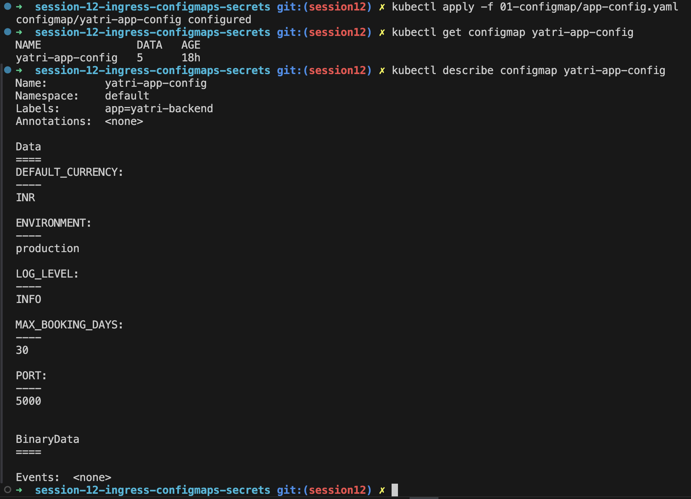

```bash
kubectl get configmap yatri-app-config -o jsonpath='{.data.ENVIRONMENT}' && echo ""
kubectl get configmap yatri-app-config -o jsonpath='{.data.LOG_LEVEL}' && echo ""
```

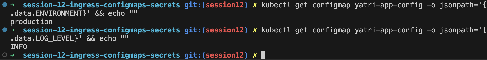

---

## ConfigMap Live Update & Pod Immobility Drill

Updating a ConfigMap does **not** automatically update environment variables inside active running containers. A rolling restart is required to load new values.

### Verification Workflow

```bash
# 1. Patch ConfigMap live
kubectl patch configmap yatri-app-config --type merge -p '{"data":{"ENVIRONMENT":"staging"}}'
```

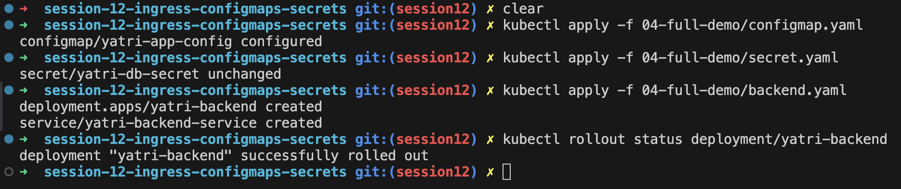

```bash
# 2. Check running pod env (shows un-updated ENVIRONMENT=production)
kubectl exec -it deploy/yatri-backend -- env | grep ENVIRONMENT

# 3. Trigger rolling restart
kubectl rollout restart deployment/yatri-backend
kubectl rollout status deployment/yatri-backend

# 4. Re-check pod env (now shows ENVIRONMENT=staging)
kubectl exec -it deploy/yatri-backend -- env | grep ENVIRONMENT
```

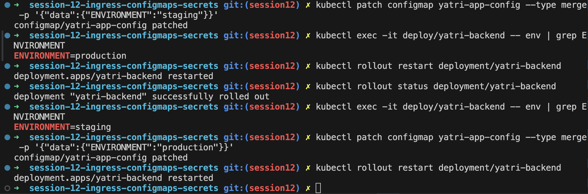

```bash
# 5. Revert patch
kubectl patch configmap yatri-app-config --type merge -p '{"data":{"ENVIRONMENT":"production"}}'
kubectl rollout restart deployment/yatri-backend
```

---

## Sensitive Data Isolation via Kubernetes Secrets & Base64 Mechanics

Kubernetes Secrets isolate sensitive credentials (passwords, tokens, keys) from plain-text manifests using Base64 encoding.

> [!IMPORTANT]
> **Base64 is Encoding, Not Encryption!** Base64 strings in `Opaque` secrets are for safe data transfer. Etcd encryption-at-rest and RBAC secure the actual data.

```yaml
apiVersion: v1
kind: Secret
metadata:
  name: yatri-db-secret
type: Opaque
data:
  POSTGRES_DB: eWF0cmlfcHJvZHVjdGlvbl9kYg==
  POSTGRES_USER: eWF0cmlfYWRtaW4=
  POSTGRES_PASSWORD: c2VjcmV0cGFzc3dvcmQ=
```

### Retrieving & Decoding Secrets

```bash
kubectl get secret yatri-db-secret -o jsonpath='{.data.POSTGRES_PASSWORD}' | base64 --decode && echo ""
```

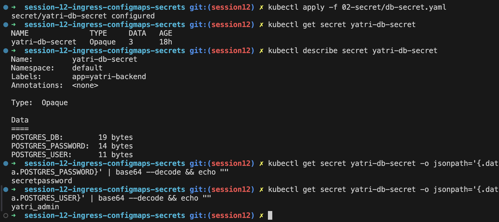

---

## The Trailing Newline Secret Gotcha

Standard `echo` appends an invisible trailing newline (`\n` / `0x0A`), which gets encoded into the Base64 string and causes authentication failures in applications.

| Command | Binary Payload | Base64 Encoded | Result |
| :--- | :--- | :--- | :--- |
| `echo "password" \| base64` | `password\n` | `cGFzc3dvcmQK` | ❌ Auth Failure (Extra `\n`) |
| `echo -n "password" \| base64` | `password` | `cGFzc3dvcmQ=` | ✅ Successful Auth |

---

## Enterprise Secret Management & Pipeline Integration

Hardcoding Base64 secrets in Git repositories is a major security risk. Production environments integrate external secret managers.

```text
  Enterprise Vault / Cloud Secret Manager ──► External Secrets Operator (ESO) ──► Native K8s Secret
```

* **External Secrets Operator (ESO)**: Automatically syncs secrets from AWS Secrets Manager, Azure Key Vault, or HashiCorp Vault into native Kubernetes Secrets.
* **HashiCorp Vault Sidecar**: Injects secrets directly into pod shared memory (`/vault/secrets`), bypassing Kubernetes etcd storage.
* **CI/CD Pipelines**: Secrets stored in GitHub Actions or GitLab CI variables are injected dynamically during deployment.

---

## Combined ConfigMap and Secret Pod Injection

Backend applications can consume plain-text parameters via `envFrom` and sensitive credentials via `env.valueFrom.secretKeyRef` simultaneously.

```yaml
spec:
  containers:
    - name: backend
      image: python:3.11-alpine3.19
      envFrom:
        - configMapRef:
            name: yatri-app-config
      env:
        - name: POSTGRES_USER
          valueFrom:
            secretKeyRef:
              name: yatri-db-secret
              key: POSTGRES_USER
        - name: POSTGRES_PASSWORD
          valueFrom:
            secretKeyRef:
              name: yatri-db-secret
              key: POSTGRES_PASSWORD
```

```bash
kubectl exec -it deploy/yatri-backend -- env | grep -E "ENVIRONMENT|LOG_LEVEL|POSTGRES"
```

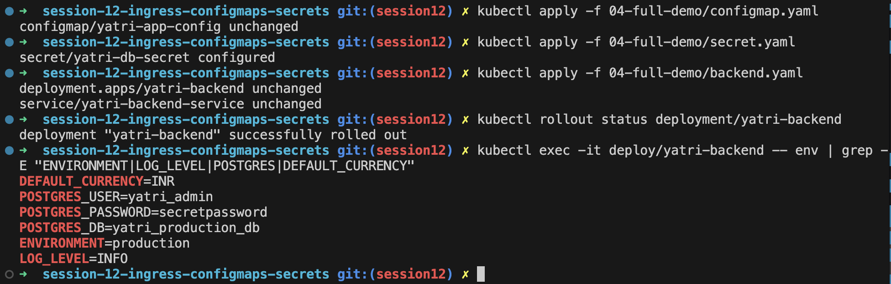

---

## Ingress Resource vs. Ingress Controller

```text
Ingress Manifest (YAML) ──► Ingress Controller (Daemon) ──► Reverse Proxy Engine ──► Services ──► Pods
```

| Component | Responsibility | Examples |
| :--- | :--- | :--- |
| **Ingress Resource** | Declarative blueprint specifying Layer 7 routing rules | `ingress.yaml` manifest |
| **Ingress Controller** | Active daemon that watches the API and executes routing | NGINX, Traefik, HAProxy, Contour |

---

## NGINX Ingress Controller Activation & Verification

Enable and verify the NGINX Ingress Controller addon on Minikube:

```bash
minikube addons enable ingress

kubectl wait --namespace ingress-nginx \
  --for=condition=ready pod \
  --selector=app.kubernetes.io/component=controller \
  --timeout=120s
```

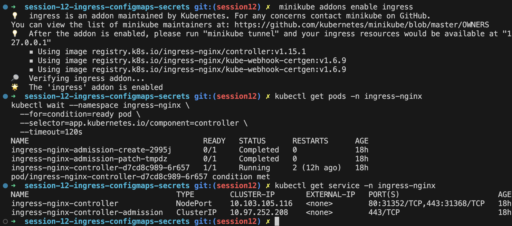

---

## Local DNS Resolution & System Hosts File Mapping

Map local custom domains to the cluster gateway IP address inside `/etc/hosts` for local domain testing.

```bash
echo "127.0.0.1  yatri.local portal.campus.local api.campus.local" | sudo tee -a /etc/hosts
```

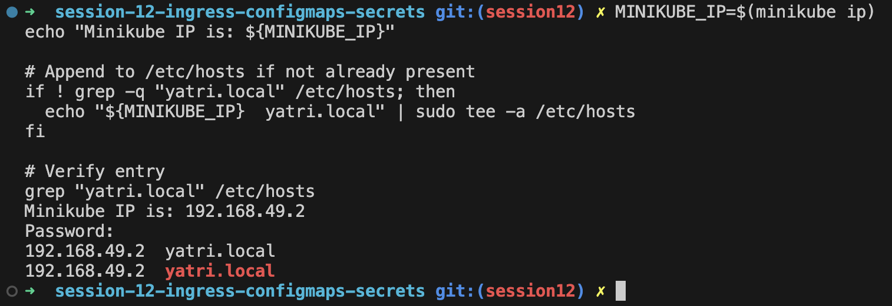

---

## Layer 7 Path-Based Routing

Path-based routing directs incoming traffic to different internal services based on URL path prefixes (`/` to frontend, `/api/` to backend).

```yaml
apiVersion: networking.k8s.io/v1
kind: Ingress
metadata:
  name: yatri-ingress
  annotations:
    nginx.ingress.kubernetes.io/ssl-redirect: "false"
    nginx.ingress.kubernetes.io/use-regex: "true"
    nginx.ingress.kubernetes.io/rewrite-target: /$2
spec:
  ingressClassName: nginx
  rules:
    - host: yatri.local
      http:
        paths:
          - path: /api(/|$)(.*)
            pathType: ImplementationSpecific
            backend:
              service:
                name: yatri-backend-service
                port:
                  number: 80
          - path: /
            pathType: Prefix
            backend:
              service:
                name: yatri-frontend-service
                port:
                  number: 80
```

```bash
kubectl get ingress yatri-ingress
kubectl describe ingress yatri-ingress
```

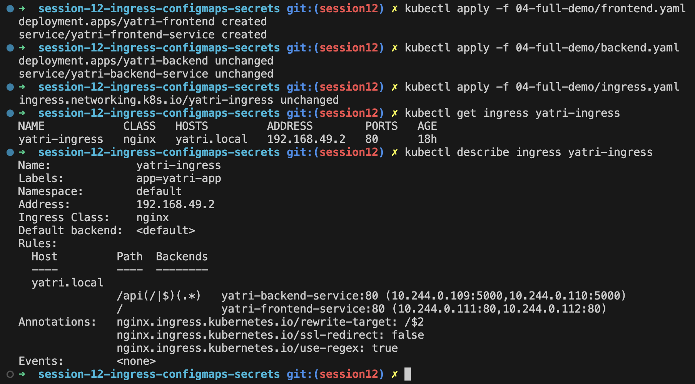

```bash
curl -s http://yatri.local/ | grep -i "<title>"
curl -s http://yatri.local/api/
```

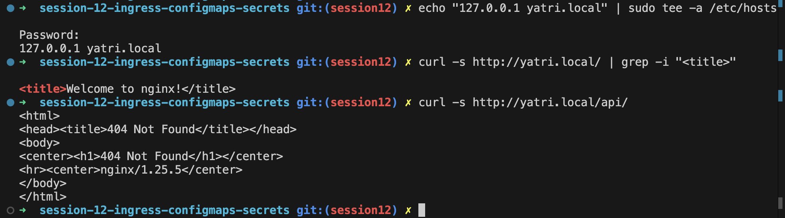

---

## Virtual Host-Based Routing (Subdomain Routing)

Subdomain routing evaluates HTTP `Host` headers to route requests across separate virtual hostnames (`portal.campus.local` and `api.campus.local`) to distinct backend services.

```yaml
apiVersion: networking.k8s.io/v1
kind: Ingress
metadata:
  name: virtual-host-ingress
spec:
  ingressClassName: nginx
  rules:
    - host: portal.campus.local
      http:
        paths:
          - path: /
            pathType: Prefix
            backend:
              service:
                name: yatri-frontend-service
                port:
                  number: 80
    - host: api.campus.local
      http:
        paths:
          - path: /
            pathType: Prefix
            backend:
              service:
                name: yatri-backend-service
                port:
                  number: 80
```

```bash
curl -s http://portal.campus.local/ | grep -i "<title>"
curl -s http://api.campus.local/
```

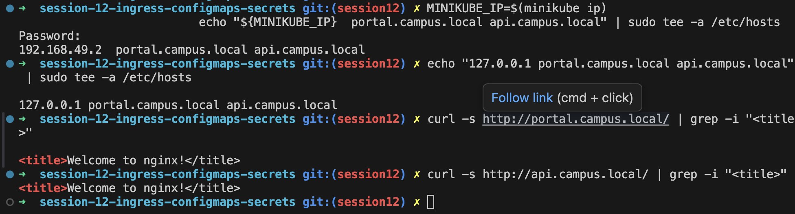

---

## Hybrid Ingress Routing Architecture

Hybrid Ingress combines host-based virtual routing and path-based URL routing within a single resource manifest.

```bash
curl -s http://portal.campus.local/
curl -s http://api.campus.local/api/
```

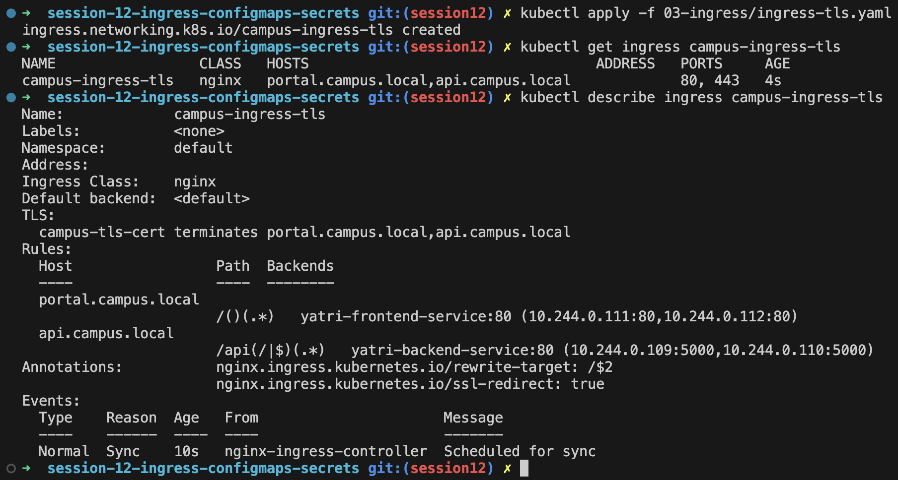

---

## Ingress TLS/HTTPS Termination

Ingress controllers terminate TLS at the cluster edge, decrypting HTTPS traffic on port 443 before forwarding HTTP to backend services.

```bash
# 1. Generate TLS certificate pair
openssl req -x509 -nodes -days 365 -newkey rsa:2048 \
  -keyout tls.key -out tls.crt -subj "/CN=yatri.local/O=YatriApp"

# 2. Create Kubernetes TLS Secret
kubectl create secret tls yatri-tls-secret --key tls.key --cert tls.crt
```

```yaml
# 3. Bind TLS Secret in Ingress
spec:
  ingressClassName: nginx
  tls:
    - hosts:
        - yatri.local
      secretName: yatri-tls-secret
```

```bash
# 4. Verify HTTPS termination
curl -k -I https://yatri.local/
```

---

## End-to-End Multi-Tier Microservice Integration & Automation

Deploying full multi-tier infrastructure by combining ConfigMaps, Secrets, Deployments, ClusterIP Services, and Ingress routing via automated scripts (`run-demo.sh` / `cleanup.sh`).

### Verification Screenshots

Applying multi-tier infrastructure:

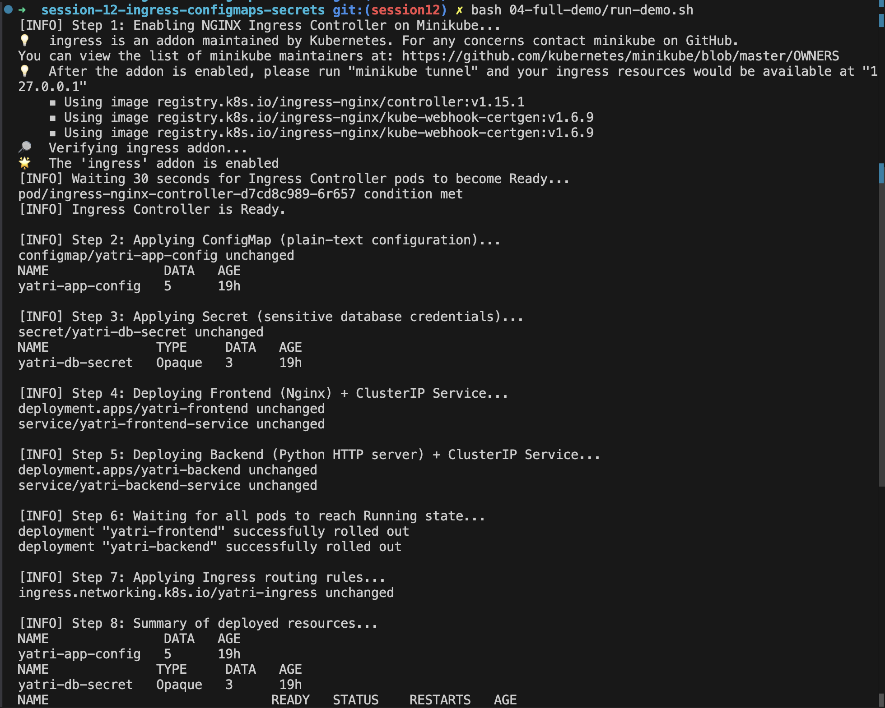

Validating running pods and services:

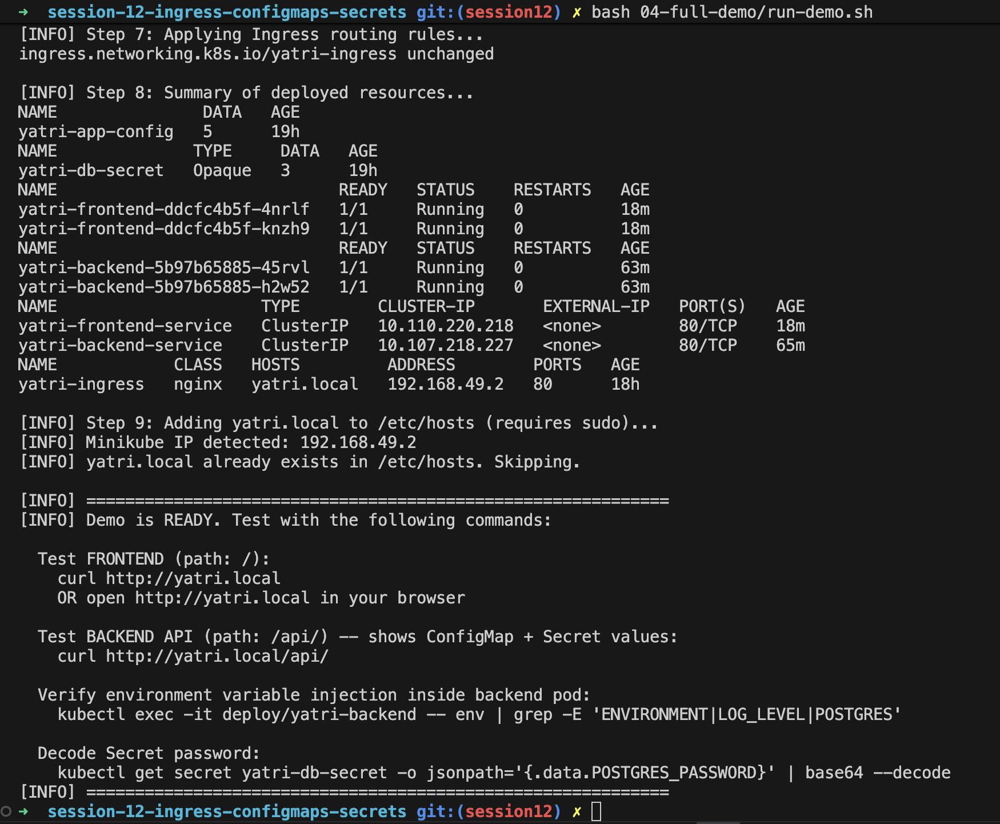

Testing live traffic routing across frontend and backend tiers:

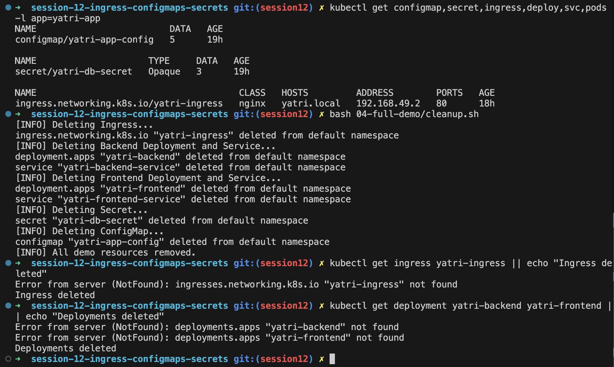
