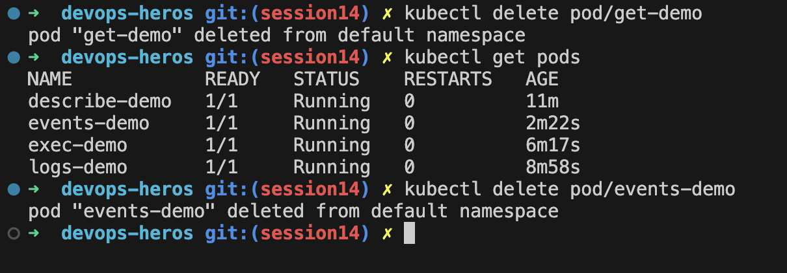
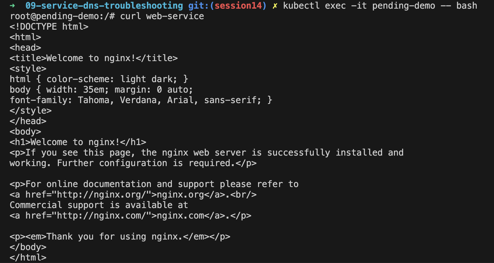

Task 1: kubectl-get

Task 2: kubectl-describe

Task3: kubectl-logs

Task4: kubectl-kubectl-exec

Task5: events

Task6 crashloopbackoff

Task7: imagepullbackoff

Task8: pending-pods

Task9: service-dns-troubleshooting

