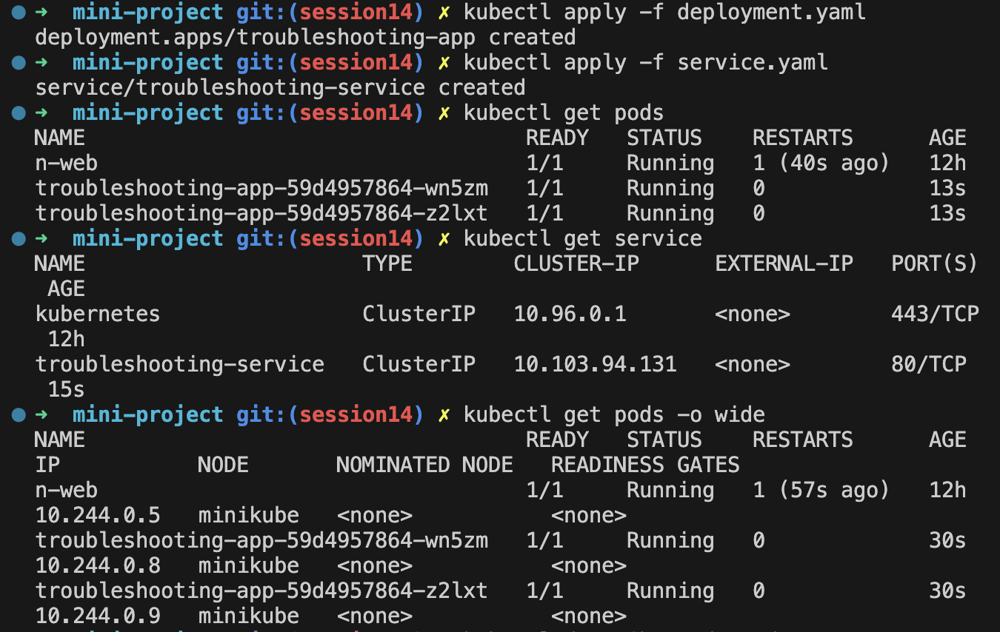
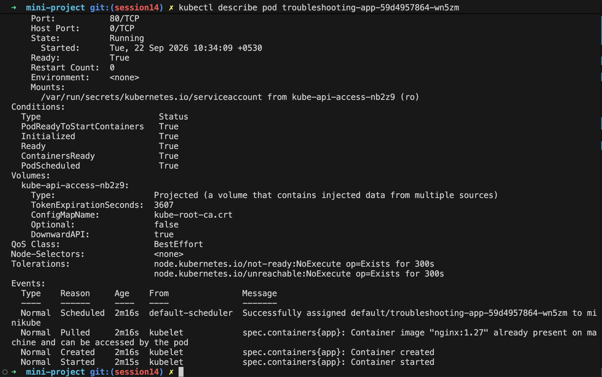
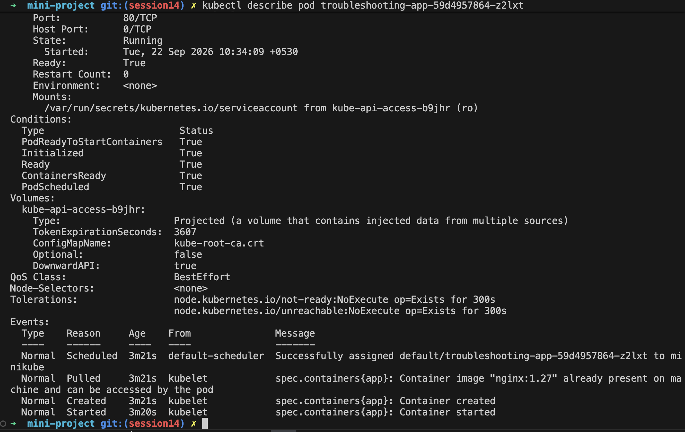
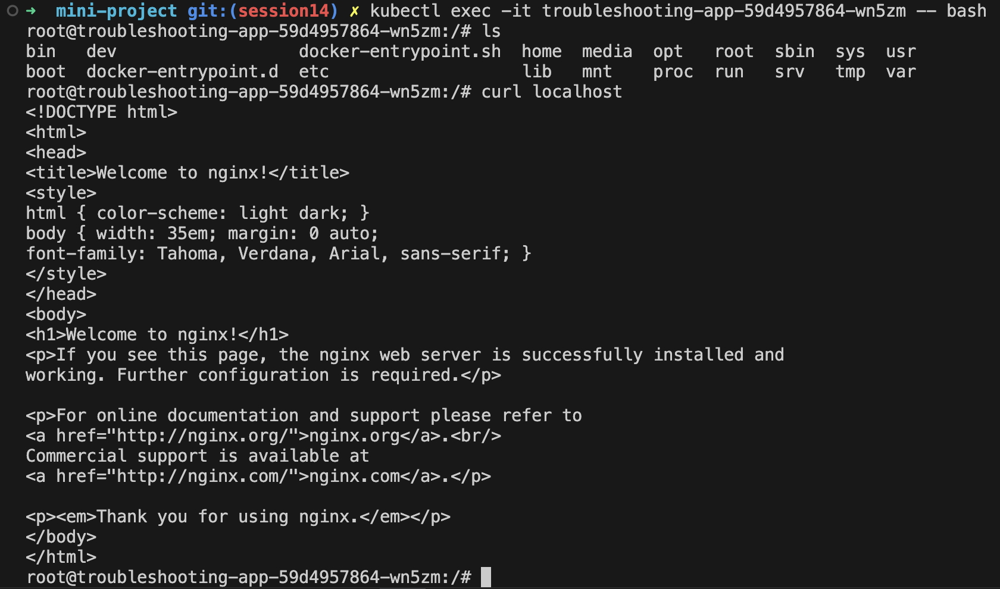
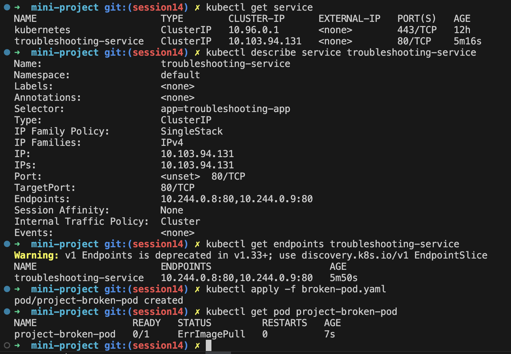
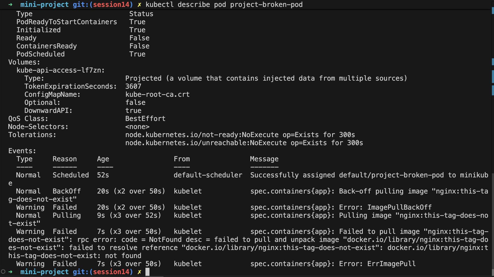
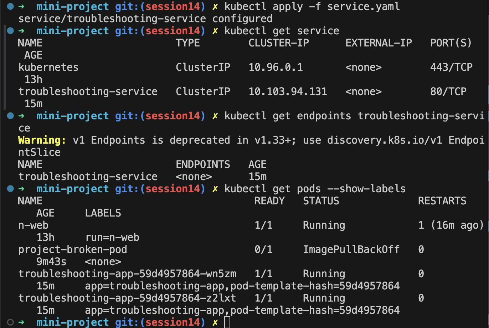
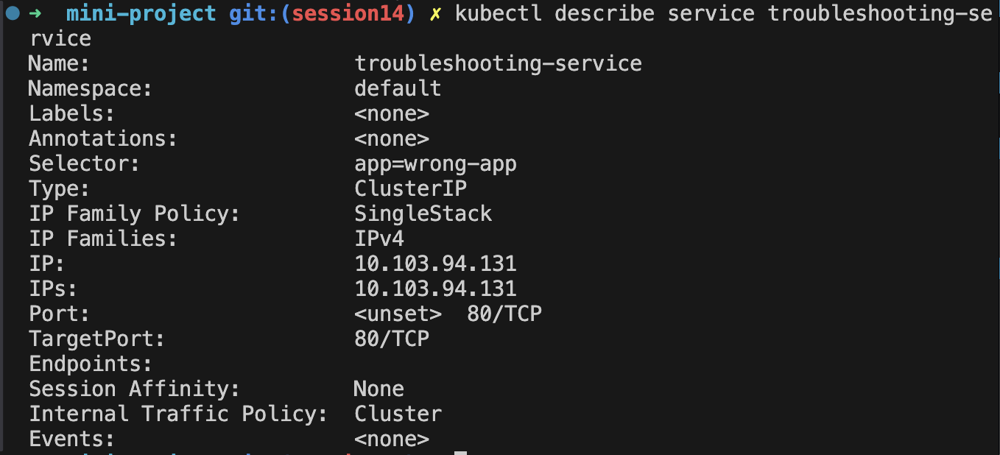

# Task 1: Difference between kubectl log and kubectl event commands

## `kubectl events` vs `kubectl logs`

### 1. What do they mean?

**`kubectl events`**
Shows **Kubernetes events** related to resources in the cluster. Events describe what Kubernetes is doing or what happened to a resource, such as scheduling, image pulling, container creation, failures, restarts, or probe failures.

```bash
kubectl events
kubectl events --for pod/<pod-name>
```

**`kubectl logs`**
Shows the **stdout/stderr output generated by an application running inside a container**. It is mainly used to understand what the application itself is doing or why it failed.

```bash
kubectl logs <pod-name>
kubectl logs <pod-name> -c <container-name>
```

### 2. Comparison

| Feature      | `kubectl events`                             | `kubectl logs`                                |
| ------------ | -------------------------------------------- | --------------------------------------------- |
| Shows        | Kubernetes events                            | Application/container output                  |
| Generated by | Kubernetes components                        | Application/container                         |
| Focus        | Cluster/resource lifecycle                   | Application behavior                          |
| Useful for   | Scheduling, deployment, probes, image issues | Errors, requests, debugging application logic |
| Stored as    | Kubernetes Event objects                     | Container logs                                |
| Example      | `Failed to pull image`                       | `Connection refused to database`              |

### 3. When to use each

#### Use `kubectl events` when:

* A Pod is stuck in `Pending`
* A container is repeatedly restarting
* An image cannot be pulled
* A Pod fails its health probes
* You want to know why Kubernetes did or did not schedule/start a Pod

```bash
kubectl events --for pod/my-pod
```

#### Use `kubectl logs` when:

* The application is crashing
* You want to see application errors
* An API is returning unexpected responses
* You need to debug application behavior
* You want to inspect output from a specific container

```bash
kubectl logs my-pod
```

### Quick Rule

> **Events tell you what Kubernetes did or encountered.**
> **Logs tell you what the application/container printed.**

For debugging a failing Pod, it is often useful to check **both**:

```bash
kubectl events --for pod/<pod-name>
kubectl logs <pod-name>
```


# Task 2: Document all troubleshooting commands
## kubectl-get


## kubectl-describe


## kubectl-logs


## kubectl-exec


## events


## crashloopbackoff


## imagepullbackoff


## pending-pods


## service-dns-troubleshooting


# Task 3: Mini project







For the broken Pod, answer:

**Question 1:** What is the Pod status?  
*Answer: ErrImagePull*  

**Question 2:** What is the actual error?  
*Answer: Failed to pull image "nginx:this-tag-does-not-exist": rpc error: code = NotFound desc = failed to pull and unpack image "docker.io/library/nginx:this-tag-does-not-exist": failed to resolve reference "docker.io/library/nginx:this-tag-does-not-exist": docker.io/library/nginx:this-tag-does-not-exist: not found*  

**Question 3:** Which command helped you find the reason?  
*Answer: kubectl describe pod project-broken-pod*  

**Question 4:** What is wrong with the image?  
*Answer: The container image tag specified in the Pod spec (nginx:this-tag-does-not-exist) does not exist in the Docker Hub image repository (docker.io/library/nginx).*  

**Question 5:** How would you fix it?  
*Answer: Update the image field in broken-pod.yaml to point to a valid, existing image tag (such as nginx:latest or nginx:alpine), delete/re-apply the manifest*




| Problem | What I Saw | Command I Used | Root Cause | Fix |
| :--- | :--- | :--- | :--- | :--- |
| **Broken Pod** | Pod status `ErrImagePull` / `ImagePullBackOff` (`0/1 READY`) | `kubectl get pod project-broken-pod`, `kubectl describe pod project-broken-pod` | Container failed to start because the image could not be fetched by kubelet | Update container image in `broken-pod.yaml` to a valid tag and re-apply |
| **Service Problem** | Service `ENDPOINTS` showing `<none>` | `kubectl get endpoints troubleshooting-service`, `kubectl describe service troubleshooting-service`, `kubectl get pods --show-labels` | Service selector (`app=wrong-app`) does not match Pod labels (`app=troubleshooting-app`) | Update `selector.app` in `service.yaml` to `troubleshooting-app` and apply with `kubectl apply -f service.yaml` |
| **Image Problem** | Failed event: `rpc error: code = NotFound desc = failed to pull ... docker.io/library/nginx:this-tag-does-not-exist: not found` | `kubectl describe pod project-broken-pod` | Non-existent image tag (`nginx:this-tag-does-not-exist`) specified in container spec | Replace image tag with a valid repository tag like `nginx:latest` or `nginx:alpine` in `broken-pod.yaml` |


Here are concise 1–2 line answers for **12. README Questions**:

---

### README Questions**

1. **What does `kubectl get` tell us?**  
   It lists cluster resources and provides a high-level summary of their current status, such as resource names, ready count, overall state, restart count, and IP addresses.

2. **What is the difference between `get` and `describe`?**  
   `kubectl get` gives a concise tabular overview of resources, whereas `kubectl describe` provides detailed configurations, status conditions, and chronological lifecycle events.

3. **Why do we use `kubectl logs`?**  
   It retrieves the standard output and error streams (`stdout`/`stderr`) emitted by application containers to debug application-level crashes or errors.

4. **When would you use `kubectl exec`?**  
   When you need an interactive shell inside a running container to inspect local files, test internal endpoints (e.g., `curl localhost`), or troubleshoot network connections.

5. **What does `CrashLoopBackOff` mean?**  
   It indicates that a container continuously starts, crashes, and exits, causing Kubernetes to back off and exponentially delay consecutive restart attempts.

6. **What does `ImagePullBackOff` mean?**  
   It means Kubernetes failed to pull the container image (due to an incorrect image name/tag, private registry auth issues, or network failure) and is backing off before retrying.

7. **Why can a Pod remain `Pending`?**  
   Because the Kubernetes scheduler cannot place it on any node due to resource limits (insufficient CPU/memory), unsatisfied node selectors/taints, or unmounted storage volumes.

8. **Why can a Service have no endpoints?**  
   Because its defined `selector` key-value pairs do not match the `labels` of any active and healthy Pods in the namespace.

9. **What is the relationship between a Service selector and Pod labels?**  
   The Service selector filters cluster Pods by matching key-value pairs in Pod labels to build its endpoints list and route network traffic.

10. **What is Kubernetes DNS?**  
    An internal cluster DNS service (e.g., CoreDNS) that assigns domain names to Services and Pods, allowing them to communicate via stable DNS names instead of volatile IP addresses.