# Session 15: Helm 

## Chart creation, linting, and rendering

From `session-15-helm/02-helm-charts/`, `helm create demo-chart` generated a starter chart containing `Chart.yaml`, `charts/`, `templates/`, and `values.yaml`. `helm lint demo-chart` reported **1 chart linted, 0 failed**; Helm also noted that a chart icon is recommended. `helm template practice-release demo-chart` rendered Kubernetes manifests locally without installing a release.

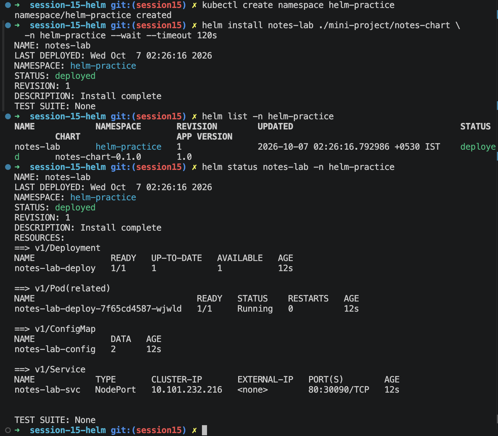

## Helm repository and search commands

The screenshots show the configured `bitnami` repository, adding the `practice-bitnami` alias for `https://charts.bitnami.com/bitnami`, updating repository indexes, listing both aliases, and searching Artifact Hub and the local repository for nginx charts. The local search returned `practice-bitnami/nginx` (chart version `25.2.1`, app version `1.31.6`). The temporary alias was removed afterward; the screenshot confirms Helm reported it removed.

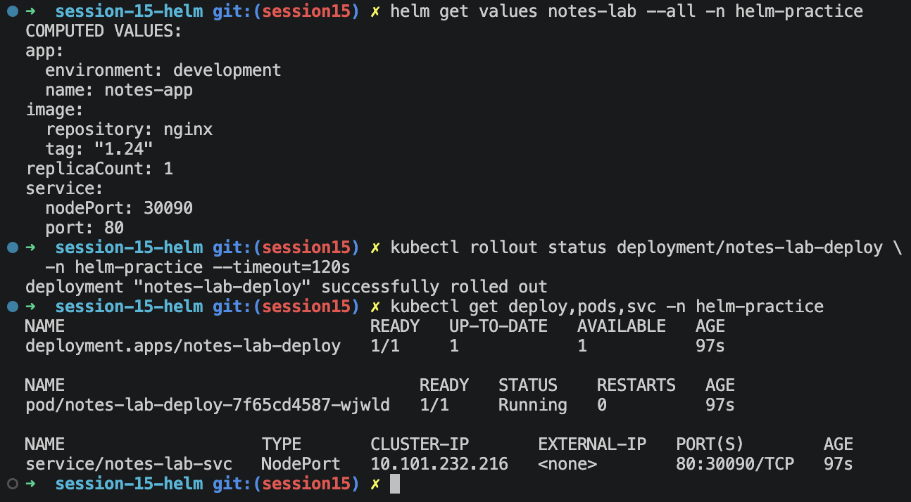

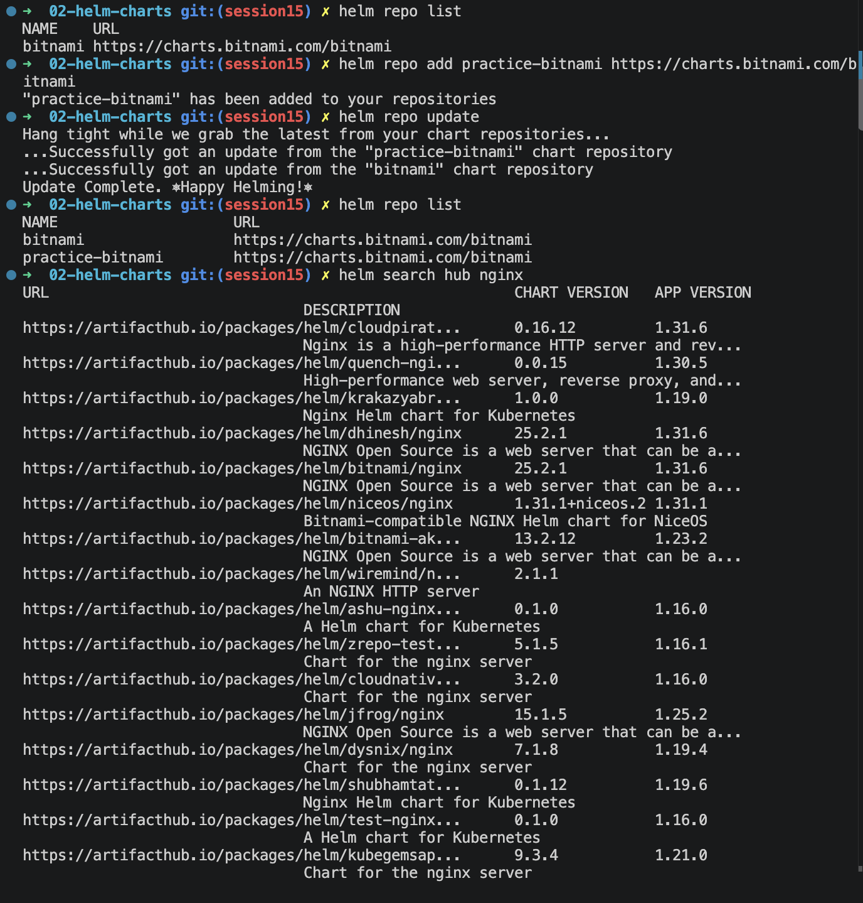

## Notes chart: install and inspect

The Notes chart was installed as release `notes-lab` in namespace `helm-practice`. The install completed with **STATUS: deployed** and **REVISION: 1**. `helm list` and `helm status` showed the deployed release. The release created a one-replica Deployment, a running pod, a ConfigMap, and a NodePort Service on `30090`.

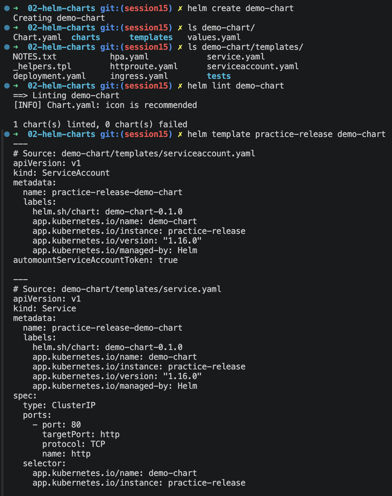

`helm get all notes-lab -n helm-practice` displayed the rendered Service and Deployment. The manifest used image `nginx:1.24`, one replica, and the Notes configuration in the ConfigMap.

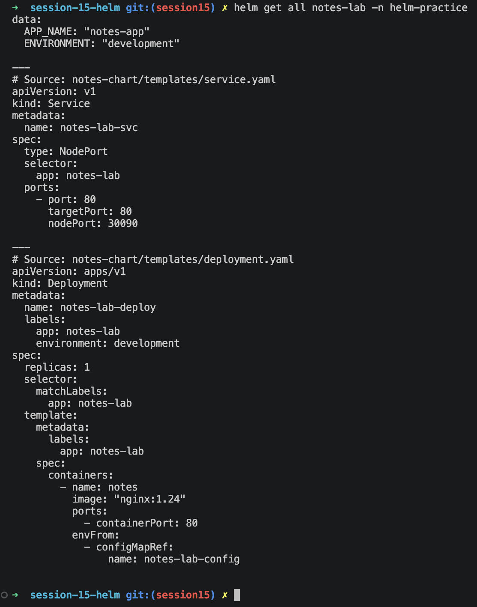

`helm get values notes-lab --all -n helm-practice` confirmed the effective defaults (`replicaCount: 1`, image tag `1.24`, development environment). `kubectl rollout status` reported a successful rollout; `kubectl get deploy,pods,svc` showed one ready replica and a running pod.

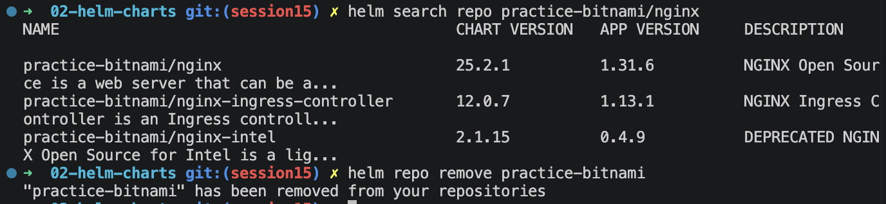


## mini-project
### Upgrade, verify, upgrade again, verify

The first upgrade set `replicaCount=2`. It completed at **REVISION: 2** with **STATUS: deployed** and both replicas ready.

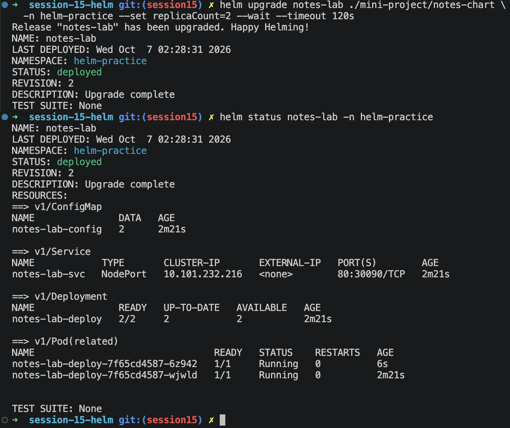

The effective values then showed `replicaCount: 2`; Kubernetes showed a `2/2` Deployment and two running pods.

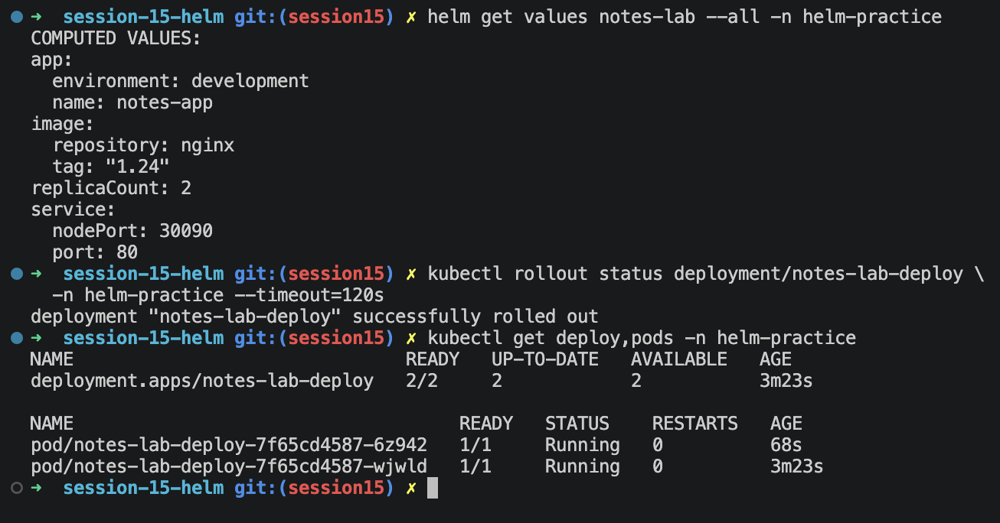

The second upgrade applied `values-prod.yaml`, changing the environment to production, image tag to `1.25`, and replica count to `3`. Helm reported **REVISION: 3** and **STATUS: deployed**. The rollout completed successfully with three ready replicas. History showed revisions 1 and 2 superseded and revision 3 deployed.

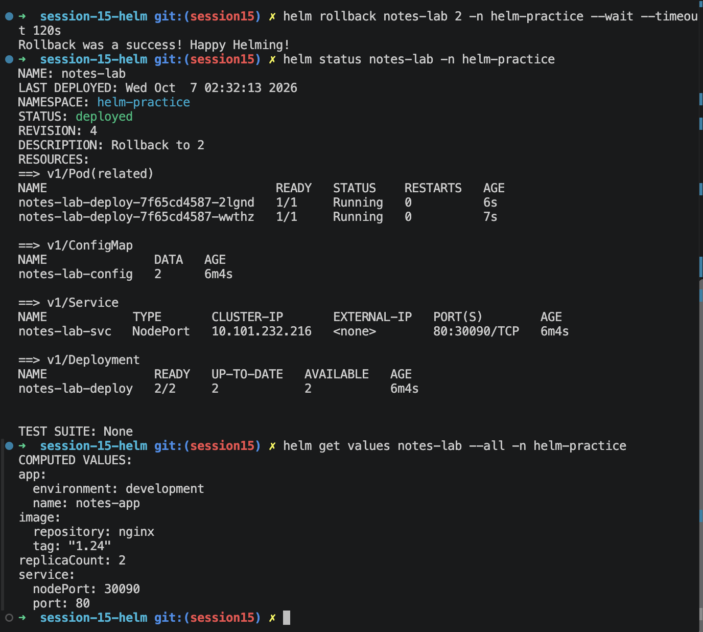

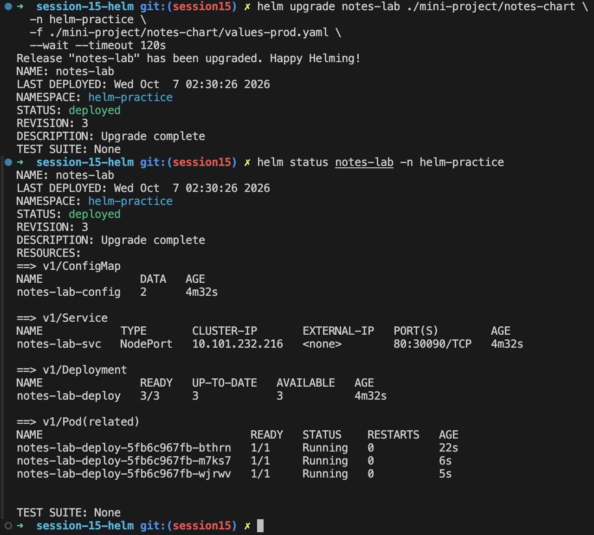

### Rollback and verification

The rollback command targeted revision 2:

```bash
helm rollback notes-lab 2 -n helm-practice --wait --timeout 120s
```

Helm reported **Rollback was a success**. `helm status` showed the new **REVISION: 4**, **STATUS: deployed**, and description `Rollback to 2`. The restored effective values showed `replicaCount: 2` and image tag `1.24`; both pods were running.

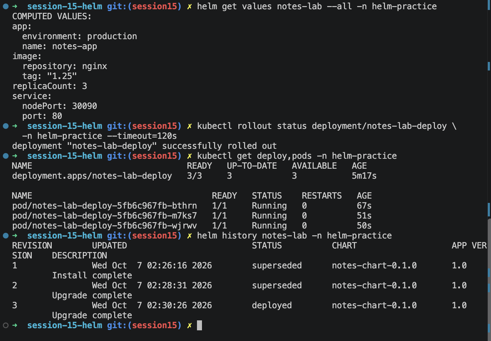

The final history confirms that rollback creates a new revision rather than deleting prior revisions: revisions 1, 2, and 3 are superseded, and revision 4 is deployed with description `Rollback to 2`.

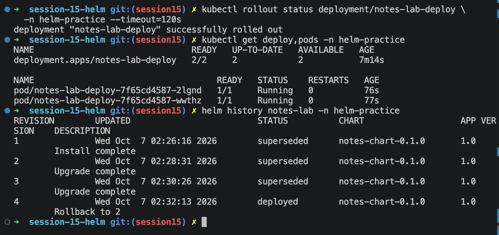

## Commands demonstrated

The captured practice covers:

```text
helm create
helm lint
helm template
helm repo list / add / update / remove
helm search hub / repo
helm install
helm list
helm status
helm get all / values
helm upgrade
helm history
helm rollback
```

The screenshots document installation, two successful upgrades, and rollback. Capture and add a screenshot of `helm uninstall` if you also want visual evidence of release cleanup; it is not shown in the current screenshots.
