# Session 10: Kubernetes Core Objects, Lifecycle & Deployment Strategies


## Cluster Health Verification & Baseline Environment Checks

Inspect Kubernetes cluster health, control plane component status, and worker node readiness states.

```bash
minikube status
kubectl version
kubectl cluster-info
kubectl get nodes
```

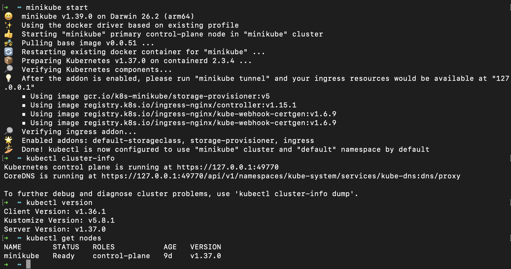

---

## Standard Pod Deployment & Extended Inspection (`pod.yml`)

Deploy a standalone Nginx Pod specifying the 4 mandatory top-level API fields (`apiVersion`, `kind`, `metadata`, `spec`).

```yaml
apiVersion: v1
kind: Pod
metadata:
  name: nginx-pod
  labels:
    app: nginx
spec:
  containers:
    - name: nginx
      image: nginx:alpine
      ports:
        - containerPort: 80
```

```bash
kubectl apply -f pod.yml
kubectl get pod nginx-pod -o wide
kubectl logs nginx-pod
kubectl delete pod nginx-pod
```

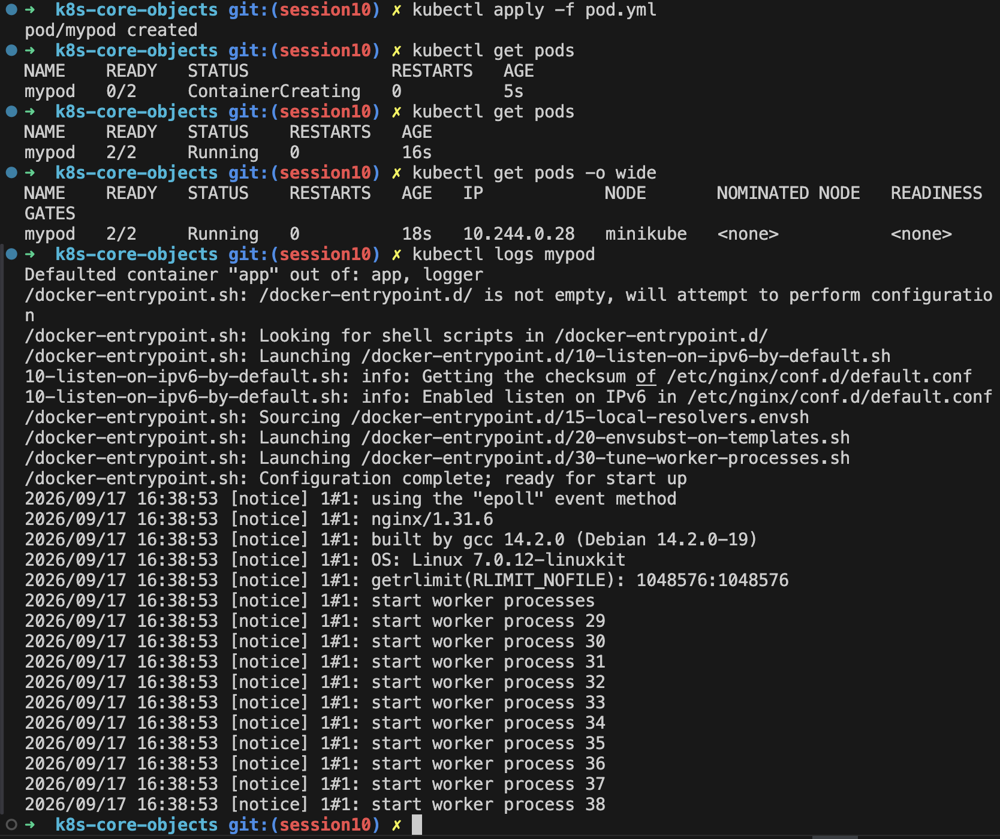

---

## Error State Simulation — `ErrImagePull` & `ImagePullBackOff`

Referencing a non-existent container image tag creates an API object in `etcd`, but container runtime initialization fails at execution.

```bash
kubectl apply -f broken-pod.yml
kubectl get pods -l app=broken-demo
```

```text
STATUS: ErrImagePull ──► Exponential Backoff ──► STATUS: ImagePullBackOff
```

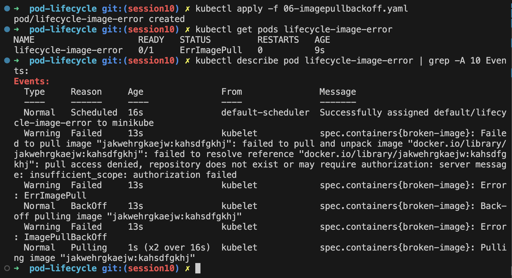

---

## Capturing Transient Pod Lifecycle Stages (`hello.yml`)

A short-lived batch container (`busybox` with `restartPolicy: Never`) transitions through transient lifecycle phases to completion.

```bash
kubectl apply -f hello.yml
kubectl get pod hello-pod -w
```

```text
ContainerCreating ──► Running ──► Completed (Phase: Succeeded)
```

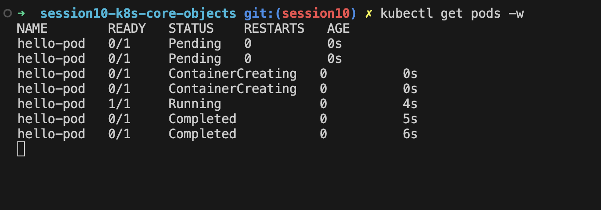

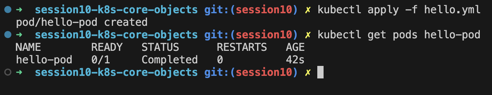

---

## Exhaustive Pod Lifecycle States & Probes Lab (`pod-lifecycle/`)

Testing container states, health probes, and initialization hooks from `session10-k8s-core-objects/pod-lifecycle/`:

* **`01-running.yaml`**: Active running container state.
* **`02-pending.yaml`**: Unschedulable pod state due to CPU/memory request pressure.
* **`03-succeeded.yaml`**: Completed batch execution (`restartPolicy: Never`, exit code 0).
* **`04-failed.yaml`**: Failed container execution (`restartPolicy: Never`, exit code 1).
* **`05-crashloopbackoff.yaml`**: Continuous container crashing triggering exponential restart backoff.
* **`06-imagepullbackoff.yaml`**: Unresolvable container image tag.
* **`07-readiness.yaml`**: Validating that `Running != Ready` before allowing service traffic.
* **`08-liveness.yaml`**: Automated container restart triggered by failing liveness health checks.
* **`09-startup.yaml`**: Protecting slow-starting applications before activating liveness checks.
* **`10-init-container.yaml`**: Executing sequential initialization tasks prior to main app startup.
* **`11-multi-container.yaml`**: Multi-container pod pattern (App container + logging sidecar).
* **`12-termination.yaml`**: Graceful shutdown handling via `SIGTERM` signals and `terminationGracePeriodSeconds`.

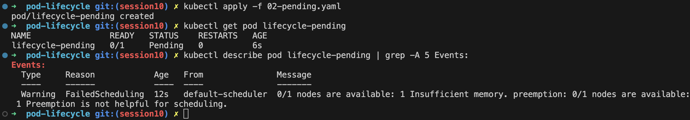

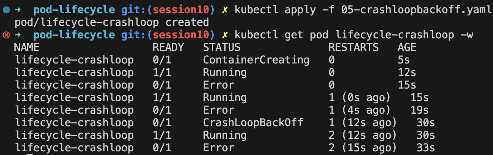

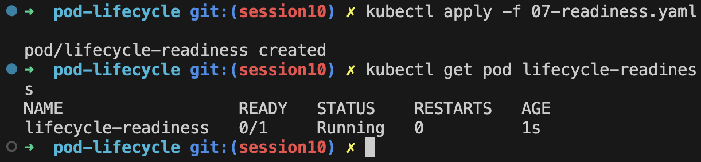

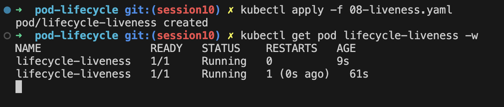

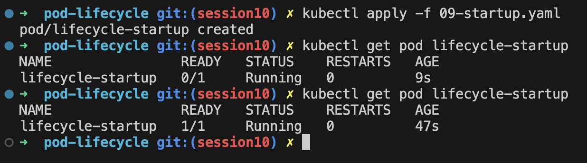

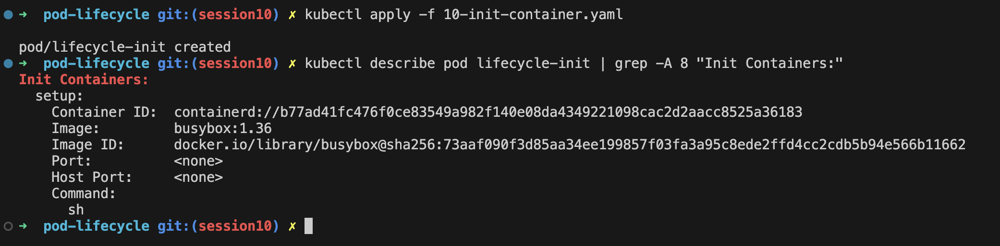

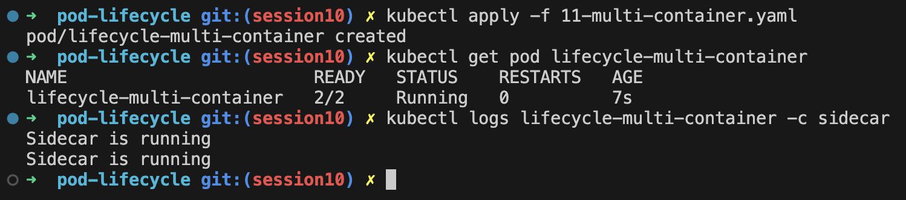

---

## Core Controller Objects Exploration (ReplicaSet & StatefulSet)

### ReplicaSet (`replicaset.yml`)
Enforces self-healing stateless replica counts. Manually deleting a pod causes the controller to immediately create a replacement.

```bash
kubectl apply -f k8s-core-objects/replicaset.yml
kubectl delete pod -l app=frontend-rs
```

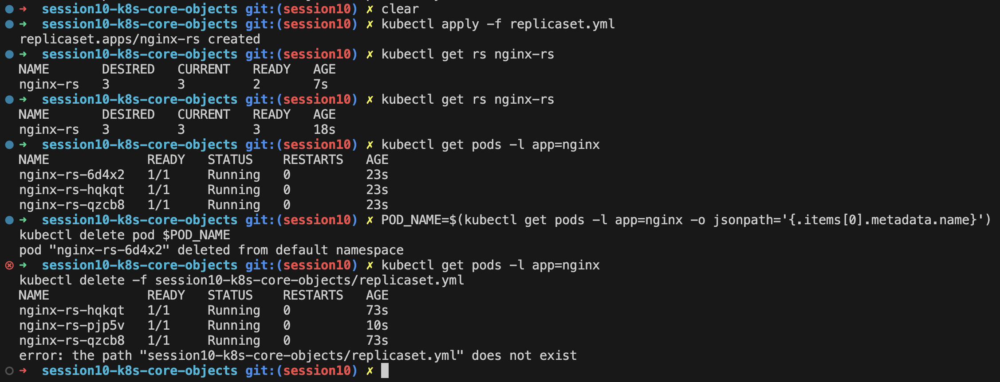

### StatefulSet (`statefulset.yml`)
Provides stable ordinal pod identifiers (`mysql-0`, `mysql-1`) and dedicated PersistentVolumeClaim bindings for stateful workloads.

```bash
kubectl apply -f k8s-core-objects/statefulset.yml
kubectl get pods -l app=mysql
```

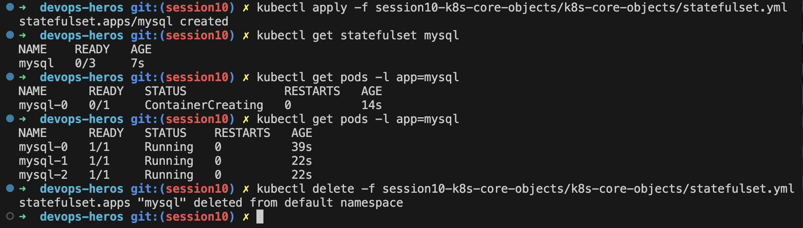

---

## DaemonSet Architecture & Host Agent Deployment (`daemonset/`)

DaemonSets ensure exactly one pod instance runs on every eligible worker node for telemetry, logging, or networking agents.

```bash
kubectl apply -f daemonset/node-agent-ds.yaml
kubectl get pods -o wide -l app=node-exporter
```

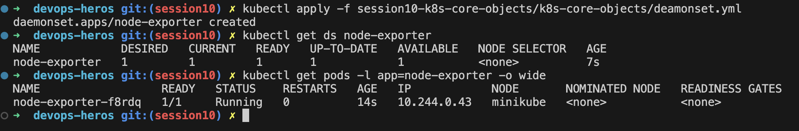

---

## Deployment Upgrades, Rolling Updates & Instant Rollbacks (`deployment/`)

Execute zero-downtime rolling updates (`maxSurge: 1`, `maxUnavailable: 0`) and instant rollbacks.

```bash
# 1. Deploy v1
kubectl apply -f 01-rolling-update/deployment-v1.yaml
kubectl rollout status deployment/yatri-backend

# 2. Update to v2
kubectl apply -f 01-rolling-update/deployment-v2.yaml
kubectl rollout status deployment/yatri-backend
```

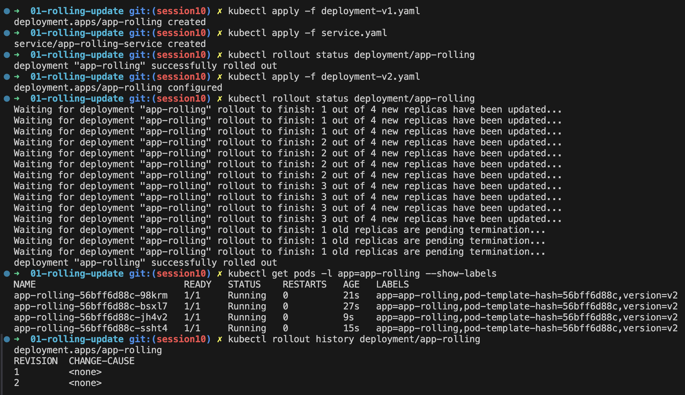

```bash
# 3. Rollback to v1
kubectl rollout undo deployment/yatri-backend
kubectl rollout history deployment/yatri-backend
```

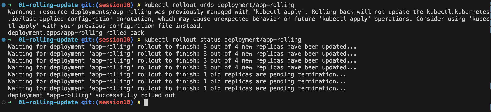

---

## Real-World Troubleshooting Scenarios Lab (`troubleshooting/`)

### Broken Image Rollout Failure (`broken-image.yaml`)
Updating a deployment with an invalid image tag causes new surge pods to stall in `ImagePullBackOff` while existing pods remain online.

```bash
kubectl apply -f troubleshooting/broken-image.yaml
kubectl rollout status deployment/yatri-backend --timeout=30s
kubectl rollout undo deployment/yatri-backend
```

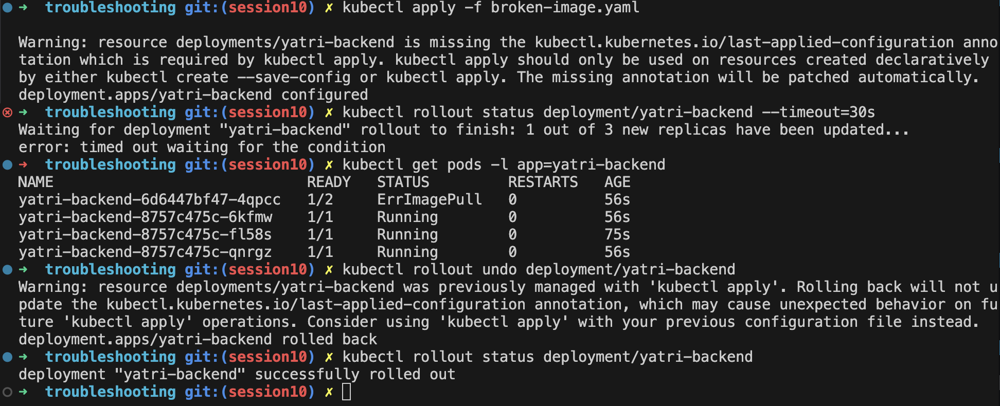

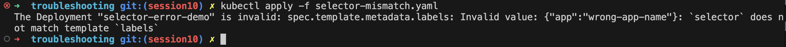

### Immutable Selector Mismatch (`selector-mismatch.yaml`)
The Kubernetes API server rejects updates where `spec.selector.matchLabels` does not match `spec.template.metadata.labels`.

```bash
kubectl apply -f troubleshooting/selector-mismatch.yaml
```

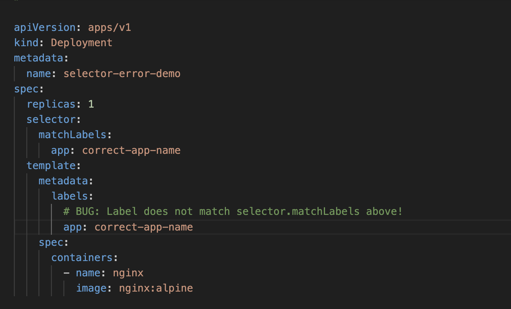

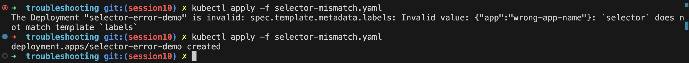

---

## Theoretical & Architectural Concepts

### 1. The 4 Kubernetes Ports

| Port | Purpose |
| :--- | :--- |
| `containerPort` | Port on which the application process listens inside the container |
| `targetPort` | Pod port where the Service forwards incoming traffic |
| `port` | Virtual cluster IP port exposed by the Kubernetes Service |
| `nodePort` | External port exposed across every worker node (`30000–32767`) |

```text
External Client ──[ NodeIP:30080 ]──► NodePort ──[ :80 ]──► ClusterIP ──[ :8080 ]──► Pod (containerPort: 8080)
```

### 2. Labels vs Selectors

* **Labels**: Key-value pairs attached to objects (`app: nginx`, `env: prod`).
* **Selectors**: Filters used by controllers and services to group matching objects (`selector: app: nginx`).

### 3. Deployment Strategies

* **RollingUpdate**: Incremental pod replacement ensuring continuous availability.
* **Recreate**: Terminates all existing pods before creating new ones (causes downtime).
* **Blue-Green**: Maintains two parallel environments and switches service selectors instantly.
* **Canary**: Releases new versions to a small fraction of pods to test real traffic before full rollout.

### 4. `maxSurge` vs `maxUnavailable`

For `replicas: 4`, `maxSurge: 1`, `maxUnavailable: 0`:
* **Maximum Pods**: `4 + 1 = 5`
* **Minimum Available Pods**: `4 - 0 = 4`

### 5. Resource Requests vs Limits & Memory Units

* **Requests**: Minimum resources guaranteed for scheduler node placement.
* **Limits**: Maximum runtime cap enforced by cgroups (exceeding CPU causes throttling; exceeding memory causes OOM kill).
* **Memory Units**: `1 GB = 10^9 bytes` vs `1 GiB = 2^30 bytes` (`1,073,741,824 bytes`).

---

## Blue-Green Deployment Execution & Instant Selector Cutover (`02-blue-green/`)

Deploy Blue (v1) and Green (v2) environments simultaneously, switching live traffic instantly by updating the Service selector.

```bash
# 1. Deploy Blue and Green workloads
kubectl apply -f 02-blue-green/deployment-blue.yaml
kubectl apply -f 02-blue-green/deployment-green.yaml
```

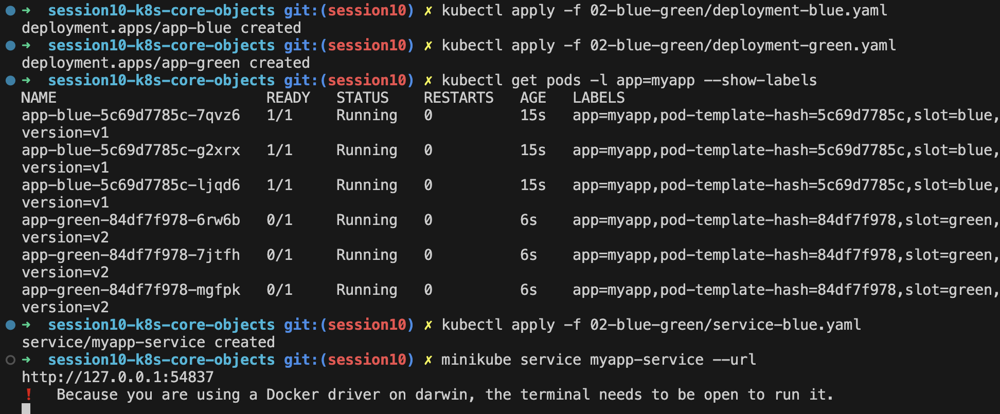

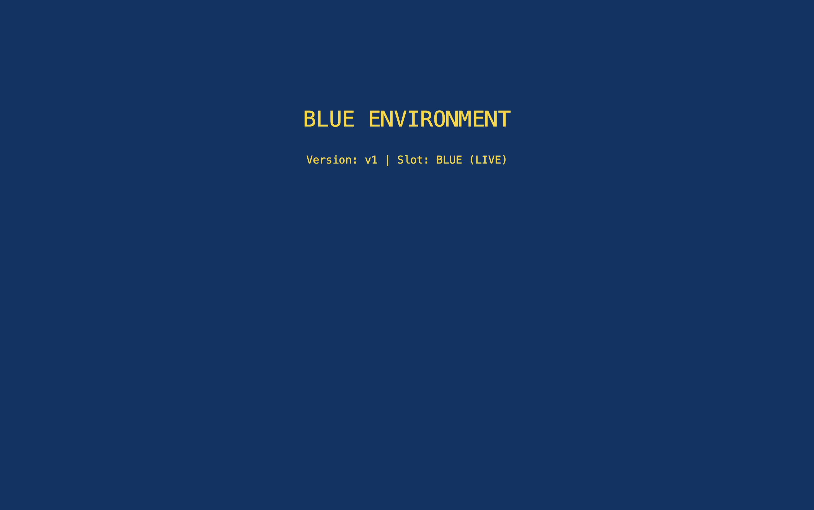

```bash
# 2. Point service to Blue
kubectl apply -f 02-blue-green/service-blue.yaml
curl -s http://localhost:30020 | grep -i "VERSION"
```

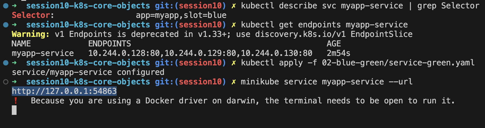

```bash
# 3. Instant cutover to Green
kubectl apply -f 02-blue-green/service-green.yaml
curl -s http://localhost:30020 | grep -i "VERSION"
```

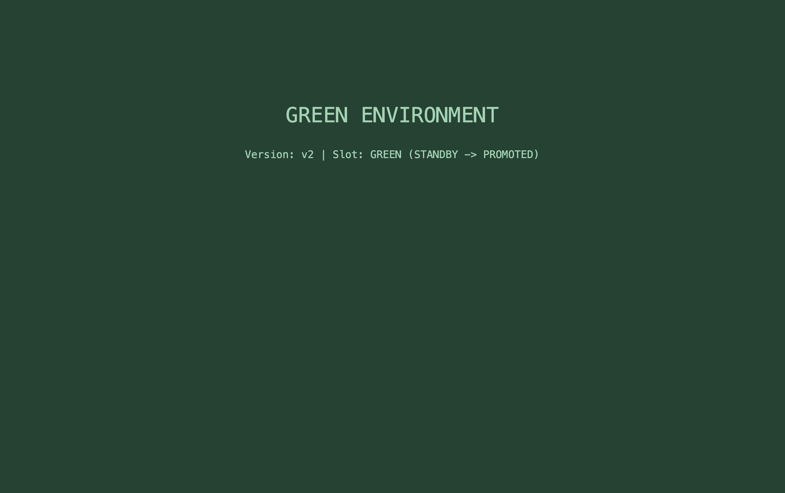

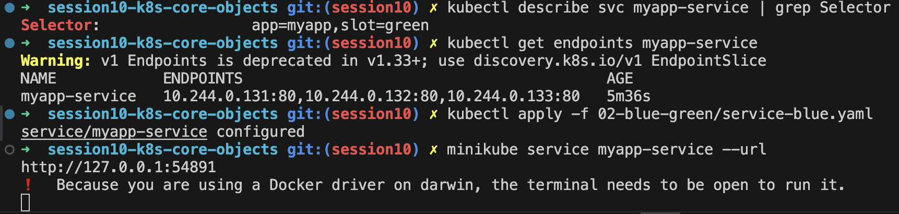

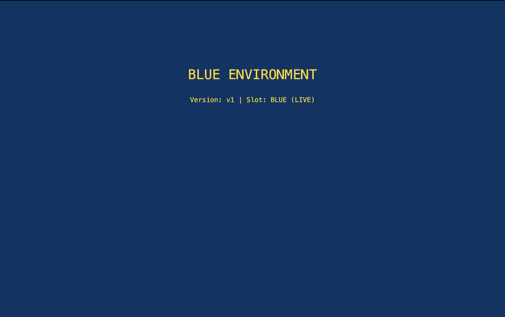

---

## Canary Deployment Execution & Pod-Ratio Traffic Splitting (`03-canary/`)

Maintain 9 stable pods (v1) and 1 canary pod (v2) behind a shared service to establish a 90%/10% traffic split.

```bash
# Deploy 9 stable pods + 1 canary pod
kubectl apply -f 03-canary/deployment-stable.yaml
kubectl apply -f 03-canary/deployment-canary.yaml
kubectl apply -f 03-canary/service.yaml
```

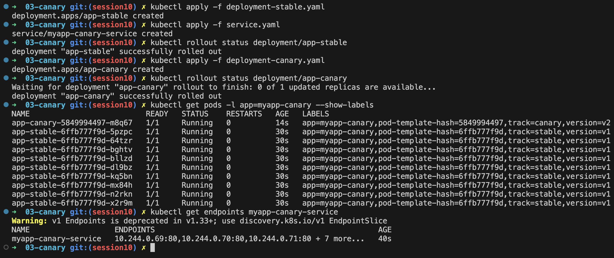

```bash
# Verify traffic distribution via curl loop
while true; do curl -s --connect-timeout 1 http://localhost:30030 | grep -o 'VERSION: [^<]*'; sleep 0.5; done
```

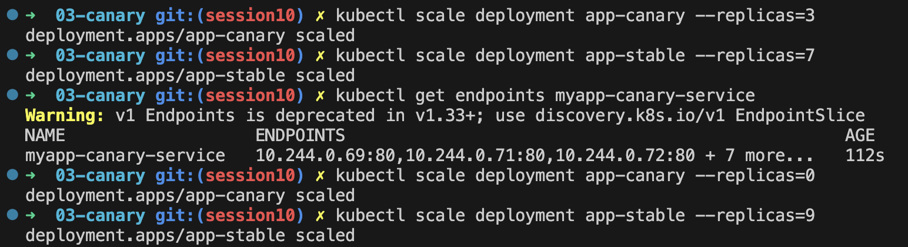

---

## Recreate Deployment Execution & Downtime Outage Demonstration (`04-recreate/`)

The `Recreate` strategy terminates all v1 pods before initializing v2 pods, creating an explicit service downtime window.

```bash
# 1. Deploy v1
kubectl apply -f 04-recreate/deployment-v1.yaml
kubectl apply -f 04-recreate/service.yaml
```

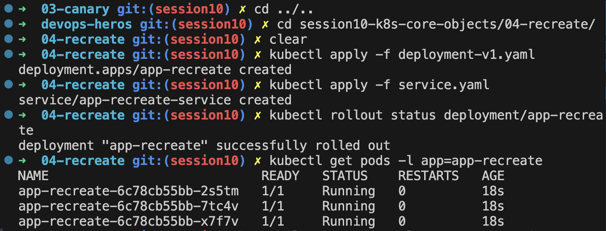

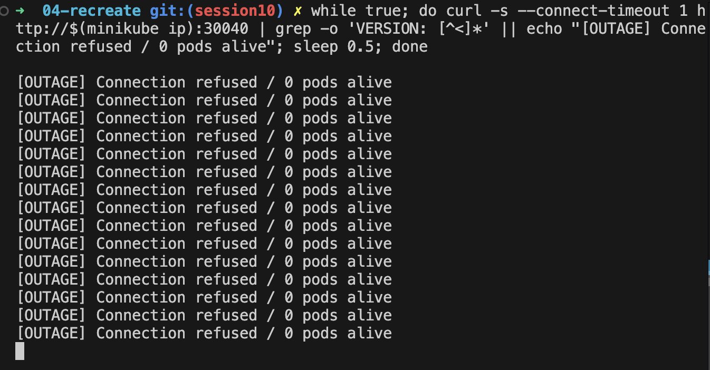

```bash
# 2. Trigger Recreate update while running curl loop
kubectl apply -f 04-recreate/deployment-v2.yaml
```

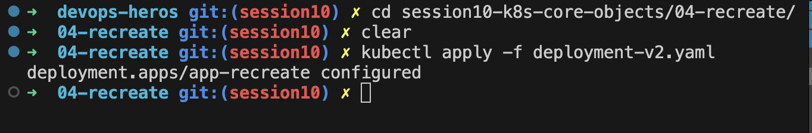

```bash
# 3. Verify restoration and rollback
kubectl rollout status deployment/app-recreate
kubectl rollout undo deployment/app-recreate
```

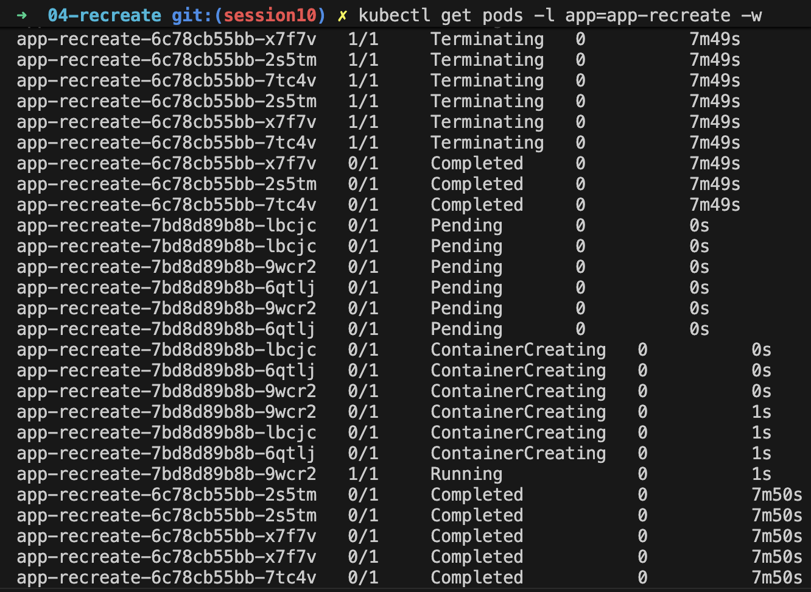
