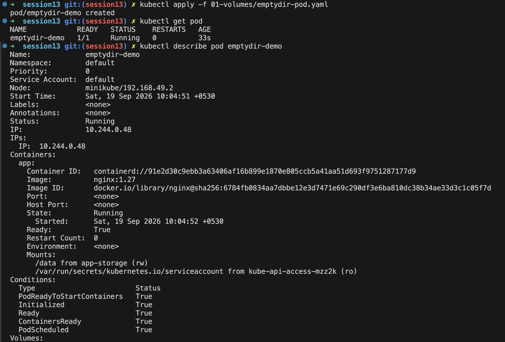
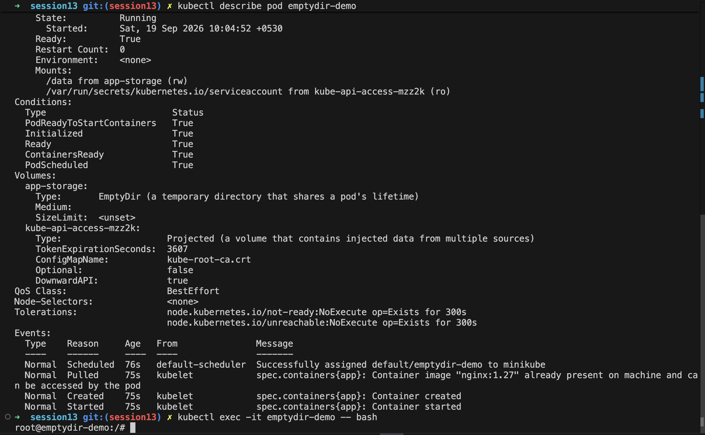
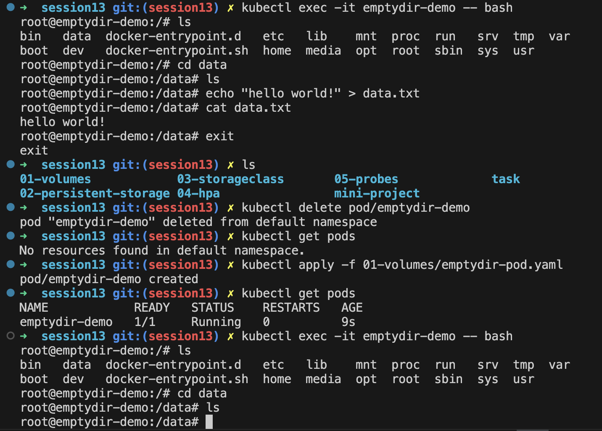
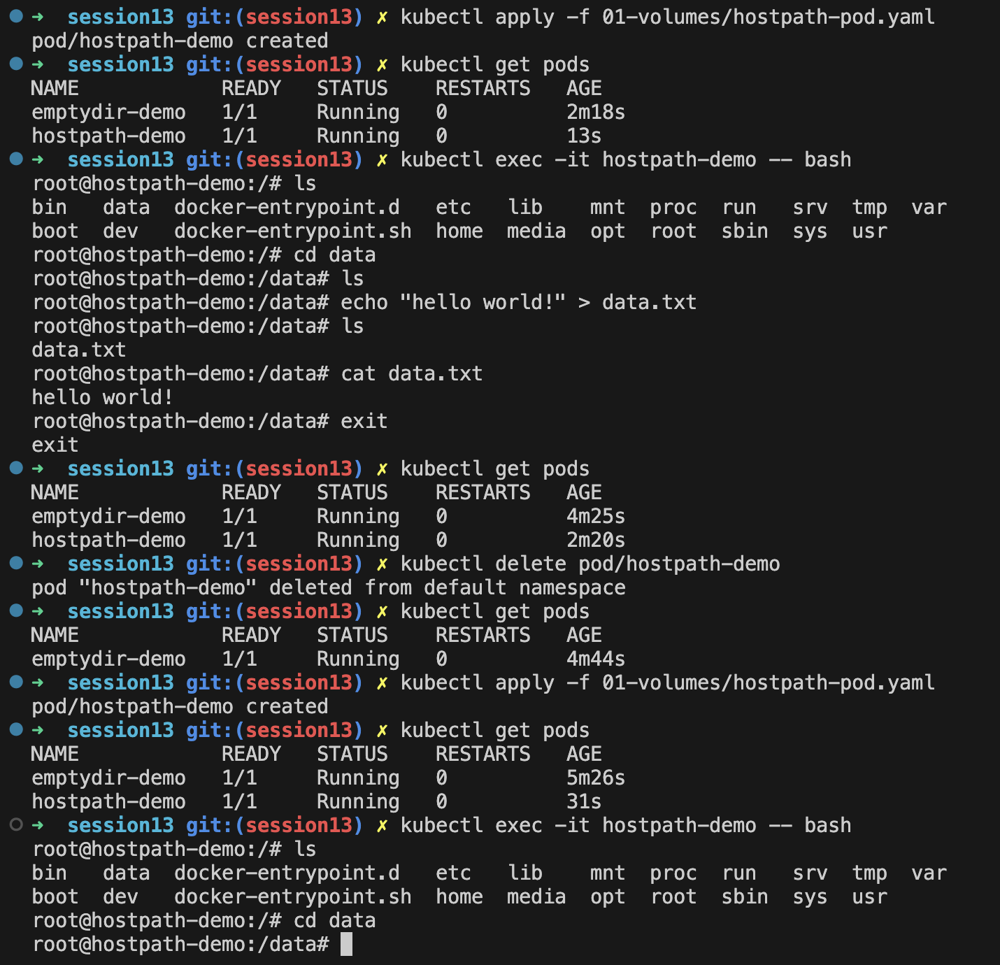
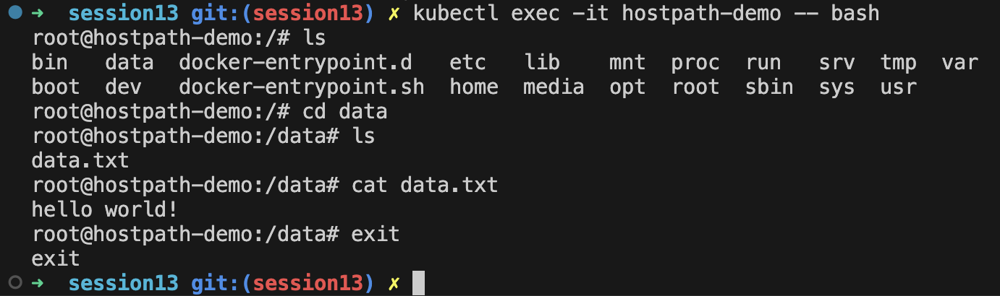
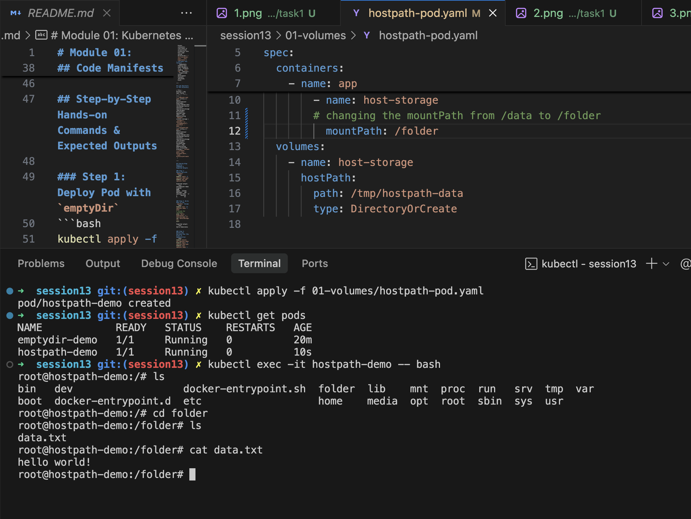

# Kubernetes Storage

## emptyDir

**emptyDir** is temporary storage created when a Pod starts.

- Shared between containers in the same Pod.
- Deleted when the Pod is removed.
- Useful for temporary files and caching.

```text
Pod
└── emptyDir
    ├── Container 1
    └── Container 2
```

## hostPath

**hostPath** mounts a directory or file from the **Node's filesystem** into a Pod.

```text
Node
└── /data
     ↓
   Pod
```

- Data can persist after a Pod is deleted.
- Tied to a specific Node.
- Mainly useful for special cases, testing, or accessing node-level files.

## PersistentVolume (PV)

A **PersistentVolume** is a piece of storage available to the Kubernetes cluster.

It exists independently of a Pod.

```text
Pod → PVC → PV → Storage
```

## PersistentVolumeClaim (PVC)

A **PVC** is a request for storage made by a user or application.

Example:

```yaml
resources:
  requests:
    storage: 10Gi
```

The PVC is matched with a suitable PV.

## StorageClass

A **StorageClass** defines **how storage should be provisioned**.

It describes the type of storage and the provisioner to use.

Example:

```text
StorageClass
     ↓
Provision storage
     ↓
PersistentVolume
```

## Dynamic Provisioning

**Dynamic provisioning** automatically creates a PersistentVolume when a PVC requests storage.

Without dynamic provisioning:

```text
Admin → Create PV → PVC → Pod
```

With dynamic provisioning:

```text
PVC → StorageClass → PV automatically created → Pod
```

This avoids manually creating PVs for every application.

## Quick Comparison

| Concept | Purpose | Lifetime |
|---|---|---|
| **emptyDir** | Temporary Pod storage | Pod lifetime |
| **hostPath** | Mount Node storage | Node-dependent |
| **PV** | Cluster storage resource | Independent of Pod |
| **PVC** | Request for storage | Independent of Pod |
| **StorageClass** | Defines storage provisioning | Configuration |
| **Dynamic Provisioning** | Automatically creates PVs | Based on PVC |

## Practical Examples

emptydir-pod




hostpath-pod



