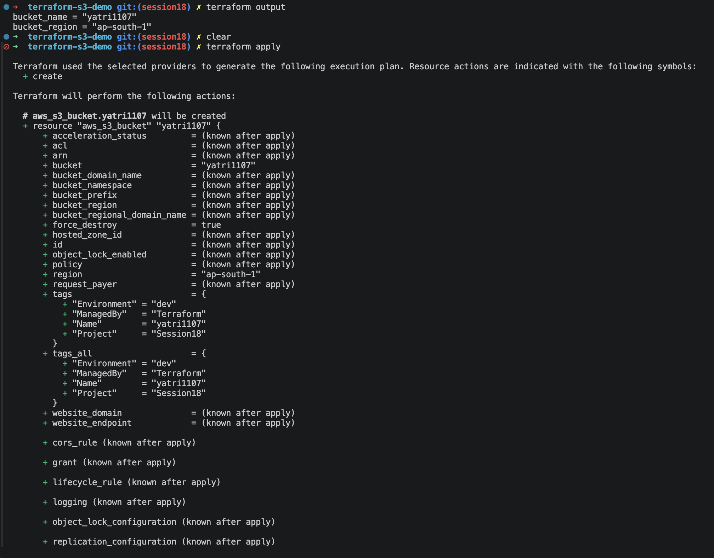

# Terraform S3 Demo

This project documents the Terraform workflow I followed to provision and validate an AWS S3 bucket using Infrastructure as Code.

## Objective

The goal was to create a simple S3 bucket with Terraform, confirm the AWS provider and variable configuration work, verify the resource in AWS, and then clean up the environment after testing.

## Workflow performed

1. Set up the Terraform project structure with provider and variable configuration.
2. Configured the AWS provider for the `ap-south-1` region and defined the bucket name.
3. Ran `terraform init` to initialize the working directory and install the required provider plugin.
4. Ran `terraform fmt` to format the configuration files and keep the code clean.
5. Ran `terraform validate` to check for syntax and configuration errors.
6. Ran `terraform plan` to preview the infrastructure changes before applying them.
7. Ran `terraform apply` and confirmed the prompt to create the S3 bucket.
8. Verified the created bucket in AWS by checking the S3 console and the CLI output.
9. Reviewed Terraform outputs and state using `terraform output` and `terraform state list`.
10. Removed the test infrastructure with `terraform destroy` after validation was complete.

## Commands used

```bash
aws configure
aws sts get-caller-identity
terraform init
terraform fmt
terraform validate
terraform plan
terraform apply
terraform output
terraform state list
terraform state show aws_s3_bucket.demo
terraform destroy
```

## Screenshot evidence

The screenshots below show the actual steps performed during the demo, including Terraform init/apply and the resulting AWS resource verification.

### 1. Terraform project and configuration



### 2. Provider, AWS auth, and Terraform init


### 3. Terraform plan/apply and successful provisioning


### 4. AWS S3 verification


## Result

The Terraform configuration successfully created the S3 bucket and verified the resource in AWS. The workflow follows the standard Terraform lifecycle:

```text
terraform init -> terraform validate -> terraform plan -> terraform apply -> verify -> terraform destroy
```

This demonstrates how infrastructure can be defined as code, applied reliably, and cleaned up once the demo is complete.
