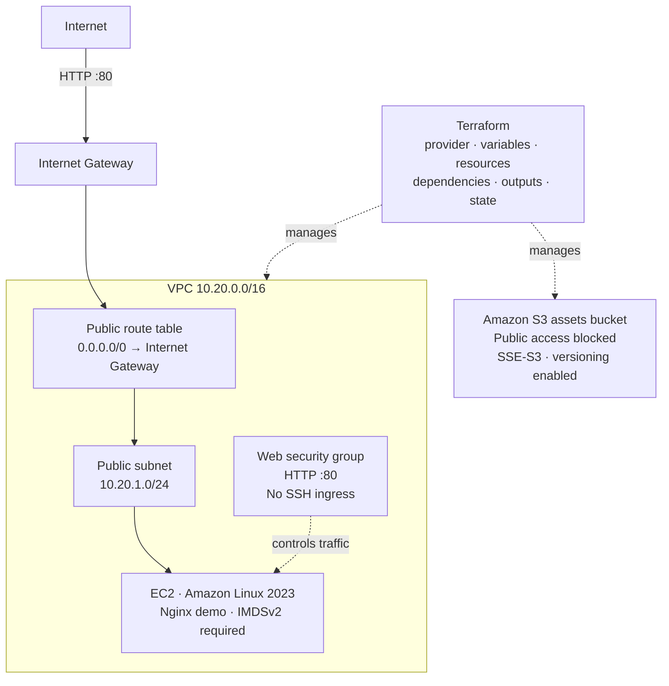
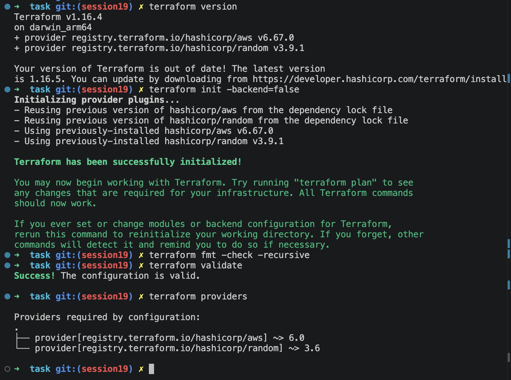

# Session 19 Terraform AWS Mini Project

Build a small, end-to-end AWS environment with Terraform: a VPC and public subnet host a demo Nginx web server, while a separate S3 bucket demonstrates private, encrypted, versioned object storage.

> **AWS credentials are not included.** This project is not deployed. Terraform can format and validate the configuration locally, but AWS credentials and network access are needed for `terraform plan`, `apply`, and `destroy`.

## Architecture



The web instance is reachable over HTTP; the security group does not allow SSH. If remote administration is needed, extend the project with a secure access method such as Systems Manager or a configured key pair and tightly restricted SSH ingress. The S3 bucket is private, blocks public access, uses SSE-S3 encryption, and has versioning enabled. It is independent from the VPC and is not configured as a Terraform state backend.

## Project contents

```text
task/
├── README.md
├── versions.tf
├── variables.tf
├── main.tf
├── outputs.tf
├── user_data.sh.tftpl
├── terraform.tfvars.example
├── .gitignore
└── screenshots/
    ├── image.png
    └── README.md
```

## What this demonstrates

- **Provider and version constraints:** AWS and Random providers are declared in `versions.tf`.
- **Variables:** Region, project naming, and instance size are configurable.
- **Resources:** VPC, subnet, internet gateway, route table, route, association, security group, EC2, and secured S3 bucket.
- **Dependencies:** Terraform infers dependencies from resource references. The EC2 instance also explicitly waits for the public route table association.
- **Outputs:** Website URL, EC2 and network identifiers, and S3 bucket details.
- **Terraform state:** The default local state file tracks the resources Terraform manages. Do not commit it or share it; it can contain sensitive data.
- **Plan, apply, and destroy:** Review a proposed change before creating resources, inspect state and outputs, and remove the resources when finished.

## Prerequisites

- Terraform `>= 1.6.0`
- An AWS account and credentials with permission to manage the listed EC2/VPC/S3 resources and read the public Amazon Linux SSM parameter
- An AWS region with an available Availability Zone and the selected EC2 instance type

Configure credentials outside this project. For example, configure an AWS CLI named profile (or AWS IAM Identity Center/SSO profile) and export its name:

```bash
export AWS_PROFILE=terraform-lab
aws sts get-caller-identity
```

The identity check should succeed before planning. Never add AWS access keys to Terraform variables, `.tfvars`, or source control.

## Configure

From this directory:

```bash
cp terraform.tfvars.example terraform.tfvars
```

Edit `terraform.tfvars` as needed:

```hcl
aws_region       = "ap-south-1"
project_name     = "session19-cloud-lab"
instance_type    = "t3.micro"
```

## Terraform workflow

Run commands from `session19-cloud-terraform/task/`.

### Initialize, format, and validate

```bash
terraform init
terraform fmt -check -recursive
terraform validate
```

`terraform init` downloads provider plugins and creates a dependency lock file. Review and commit the lock file if your repository's ignore rules permit it.

### Review the plan

```bash
terraform plan -out=tfplan
```

The plan reads the selected region's availability zones and public Amazon Linux 2023 AMI parameter. A valid AWS profile and AWS API access are therefore required; fake credential placeholders cannot produce a valid AWS plan.

### Apply

```bash
terraform apply tfplan
```

Terraform displays the created outputs. Open `website_url` after the instance bootstrap completes; first boot can take a few minutes.

### Inspect resources and state

```bash
terraform output
terraform state list
```

State is local by default (`terraform.tfstate`). Keep state files private and backed up appropriately. For a team or production environment, configure a remote backend with access controls, encryption, and locking before provisioning; the demo S3 bucket is not the backend.

### Destroy

Empty the S3 bucket first if you uploaded any objects; bucket versioning means deleting objects may leave prior versions. Then preview and confirm cleanup:

```bash
terraform plan -destroy
terraform destroy
```

The S3 bucket deliberately does not force-delete objects. Terraform will refuse to remove a non-empty bucket rather than silently deleting stored data.

## Screenshots

The screenshot below shows the local, credential-free initialization and validation checks. It is evidence of Terraform configuration validation only; it does not show an AWS plan, apply, or deployed resources.



Screenshots of a real plan, AWS Console resources, and cleanup require running the project in an AWS account. See [`screenshots/README.md`](screenshots/README.md) for the capture checklist.
