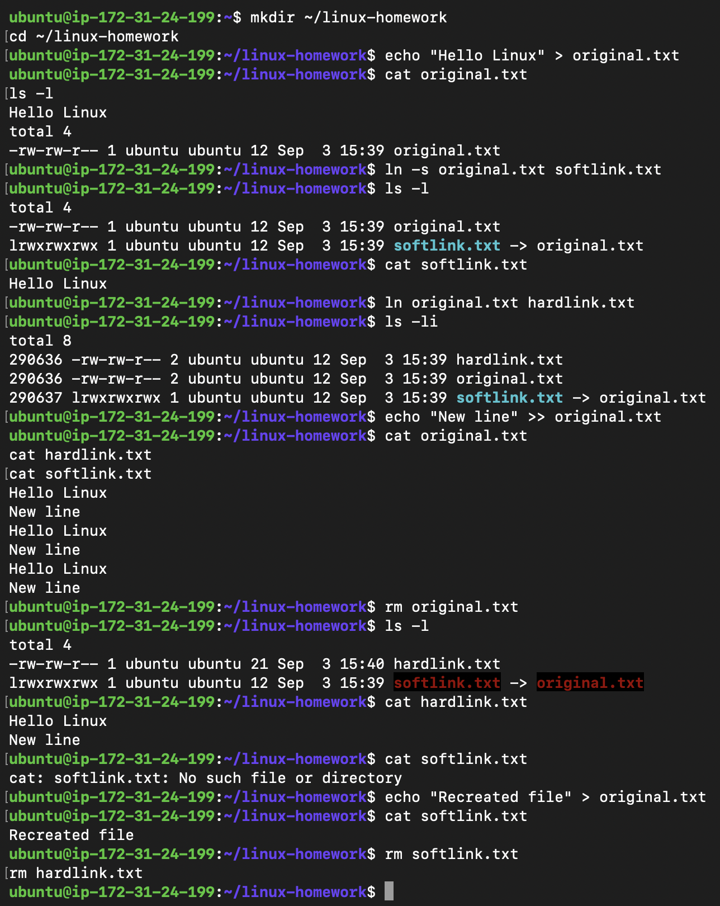
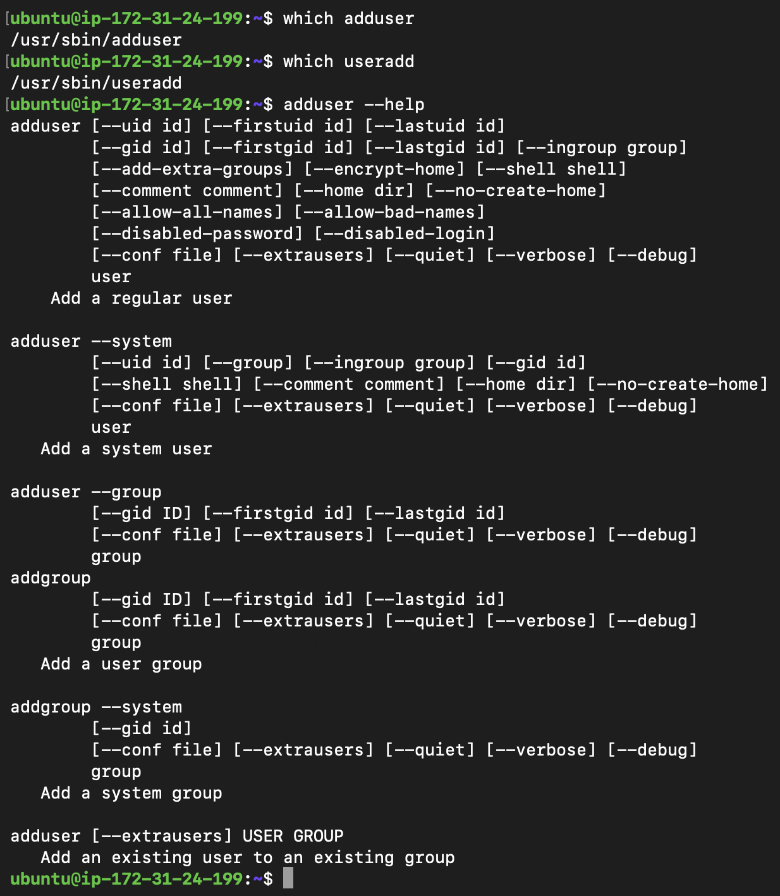
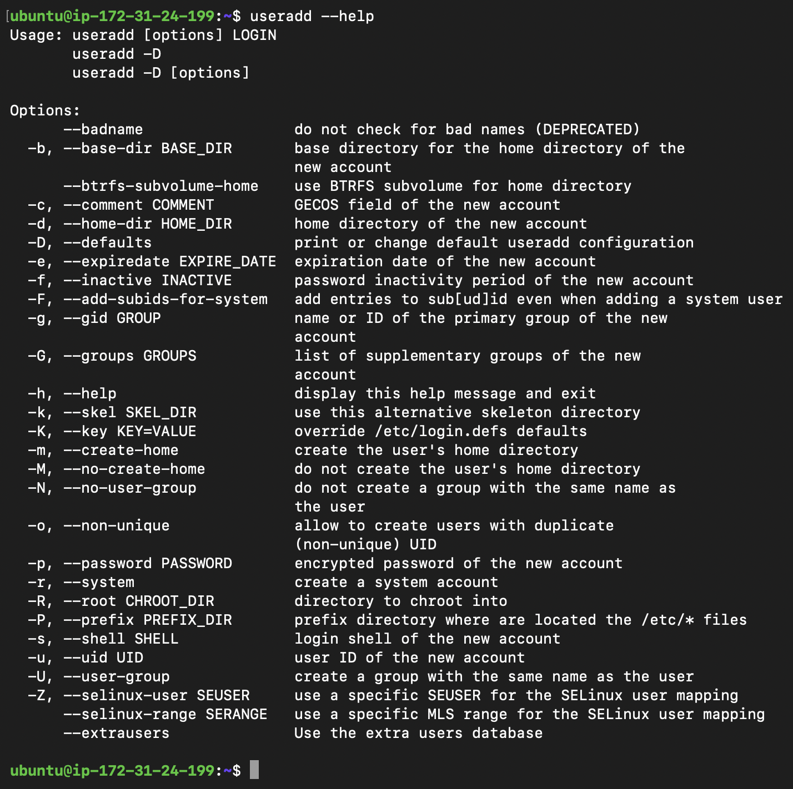
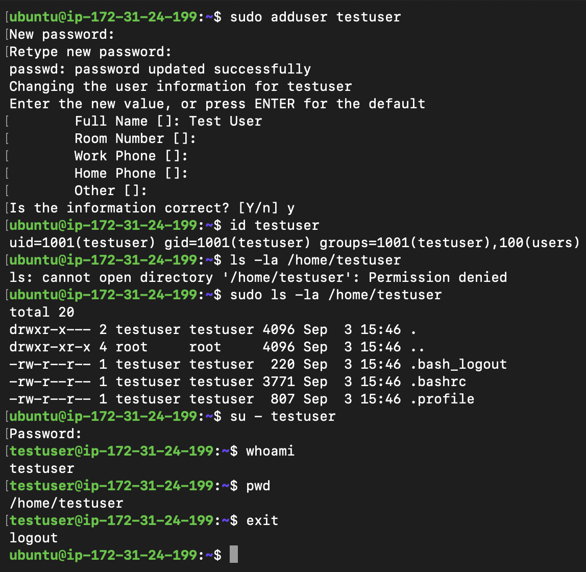
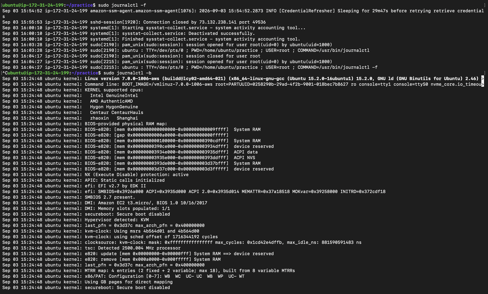
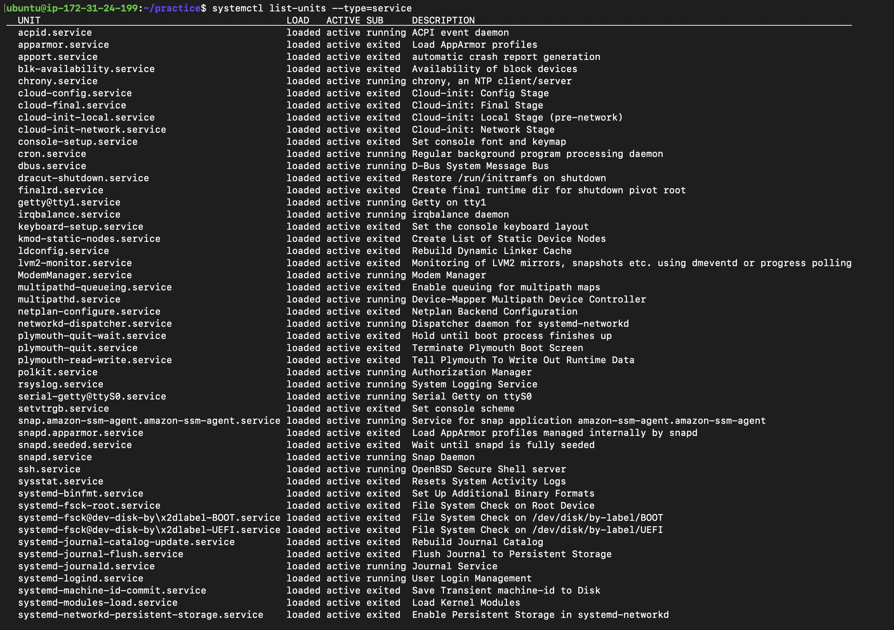
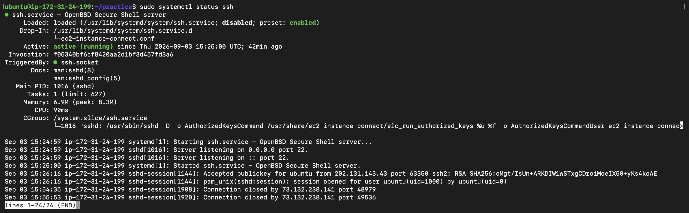
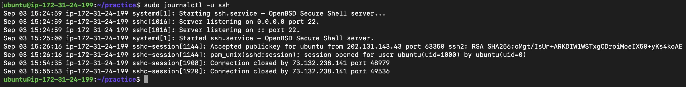
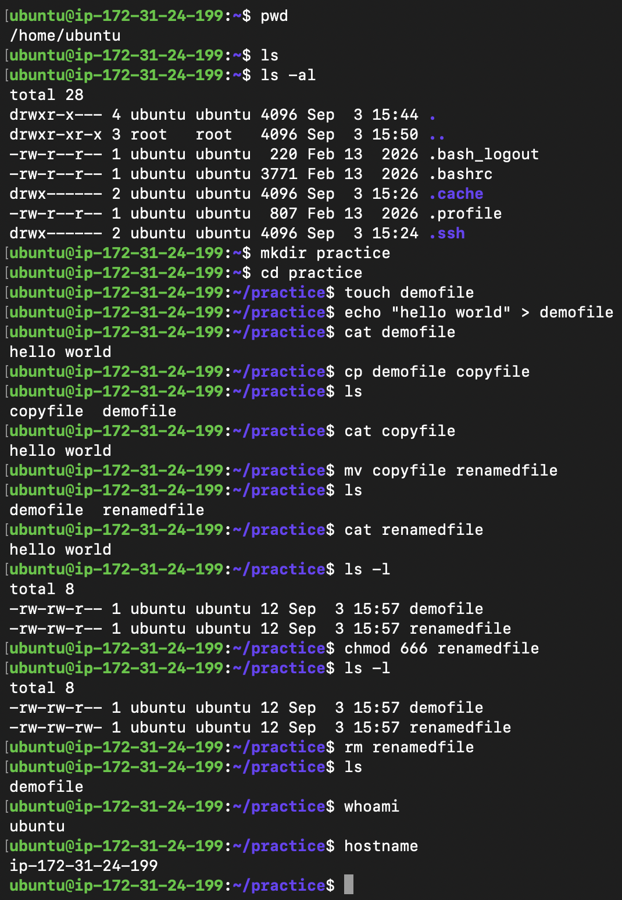
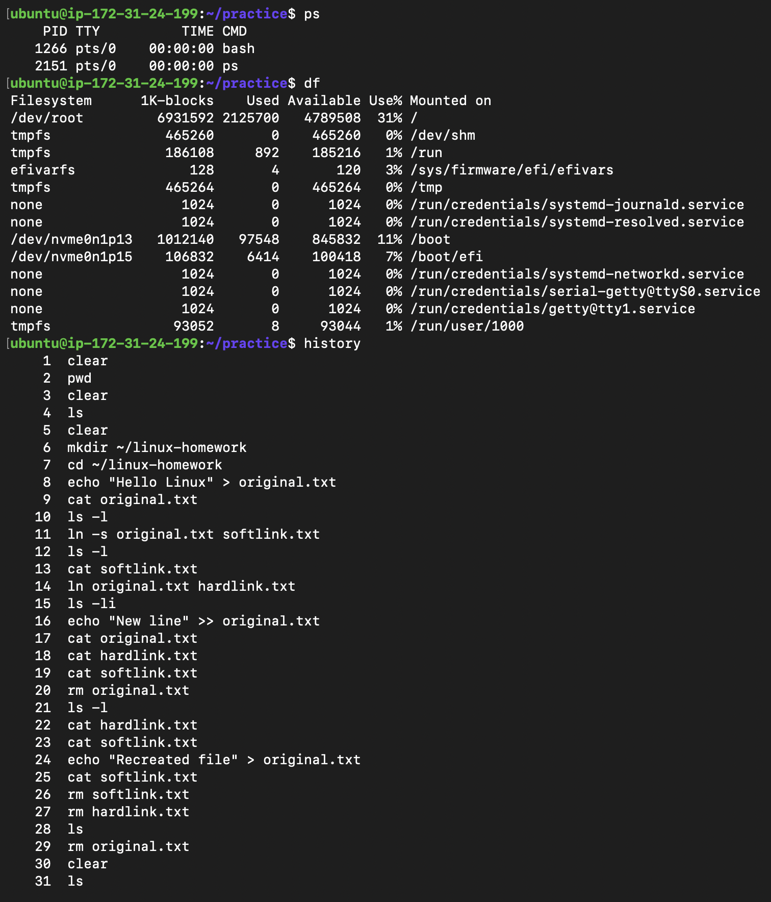

# Linux Homework Tasks

## Task 1: Soft Link & Hard Link

**Objective:** Learn the difference between soft links and hard links, practice creating and deleting both, and prepare for it as an interview question.

---

## Task 2: `adduser` vs `useradd`

**Objective:** Learn the difference between `adduser` and `useradd`, understand which is preferred on Ubuntu/Linux, and create a test user using the recommended command.

---

## Task 3: `journalctl`

**Objective:** Learn what `journalctl` is used for, how to view system and service logs, and practice checking logs for a specific service.

---

## Task 4: Linux Command Cheat Sheet

**Objective:** Review the Linux command cheat sheet, practice important commands, and understand their purpose and basic usage.

