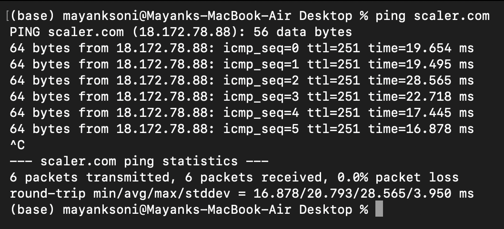
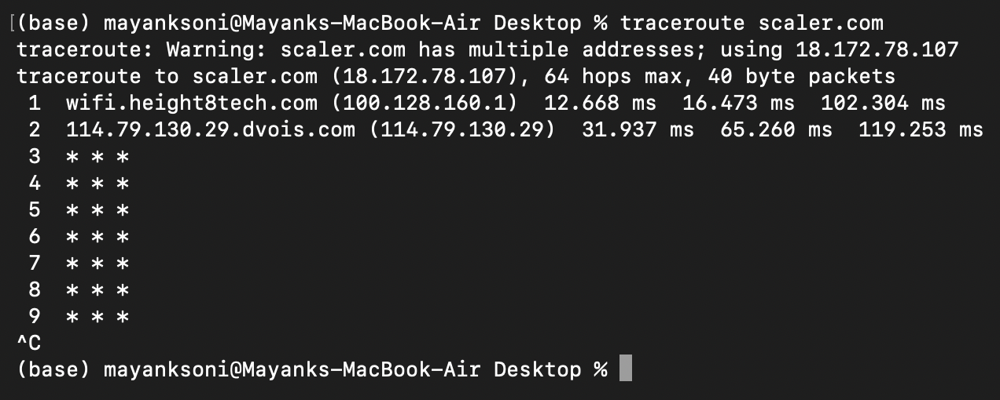
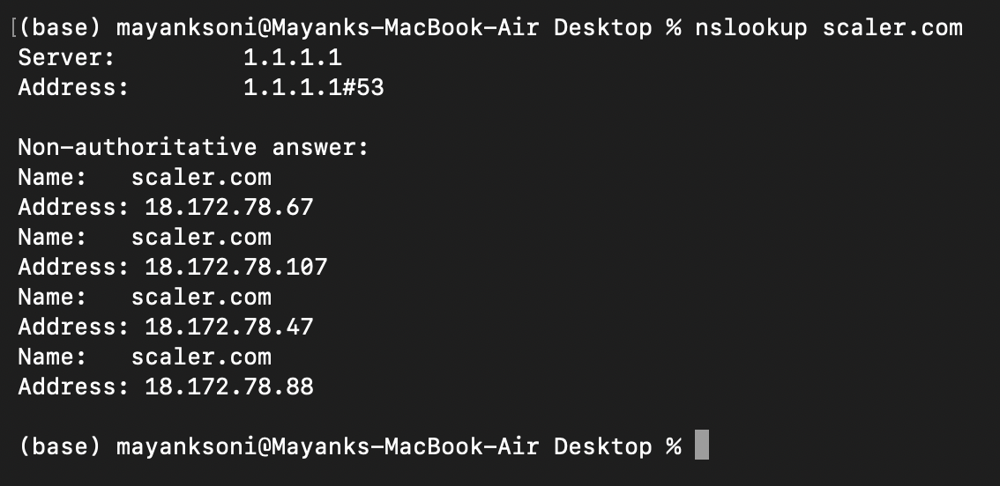
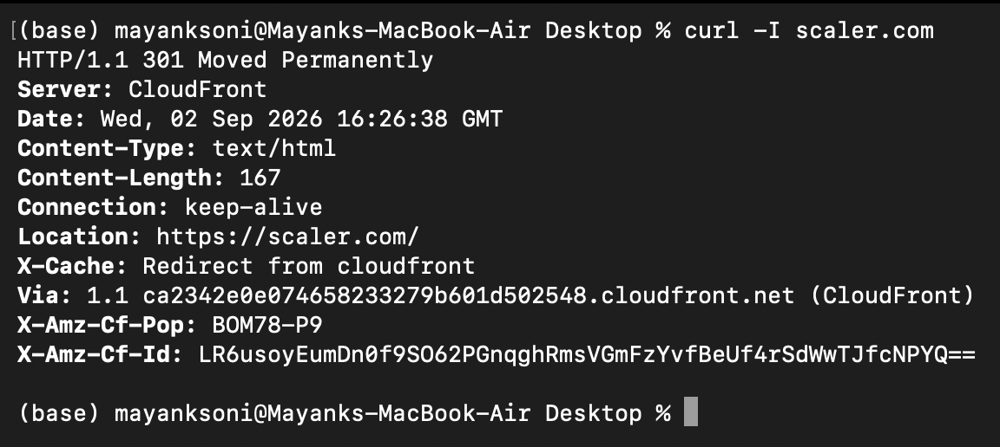
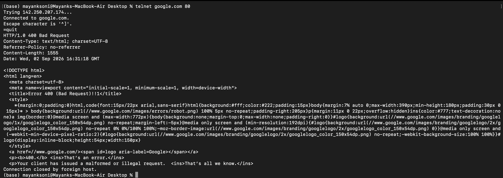
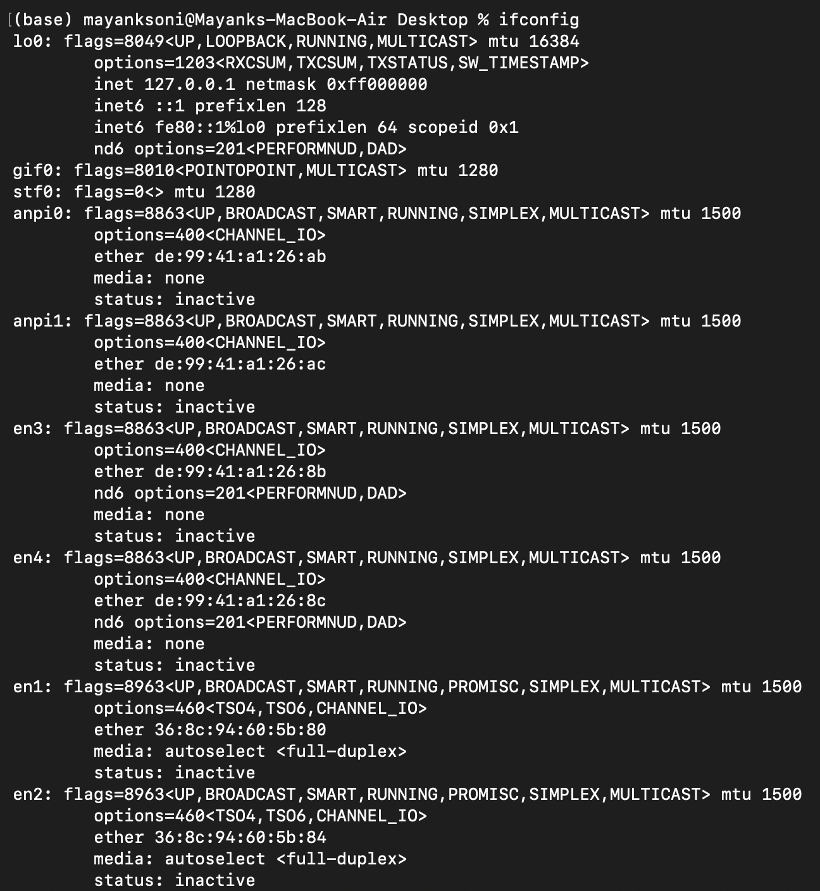
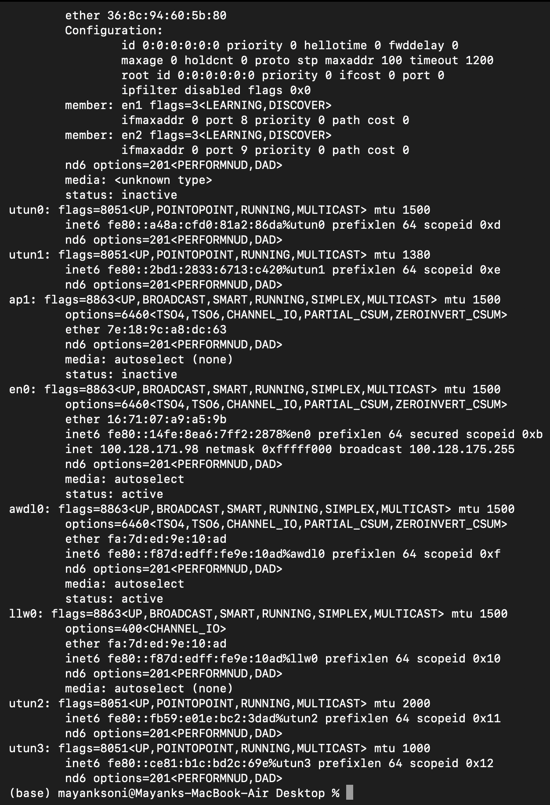
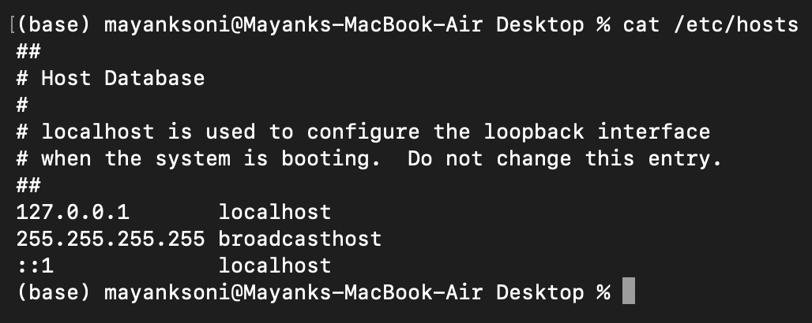

# Networking Homework Tasks

## `ping`

Sends ICMP echo requests to a host to check if it is reachable and measures the round-trip time.

---

## `traceroute`

Traces the path packets take from the source to the destination, showing each hop along the route.

---

## `nslookup`

Queries DNS servers to find the IP address(es) associated with a domain name.

---

## `curl -I`

Fetches only the HTTP response headers from a URL, useful for checking status codes, server info, and redirects.

---

## `telnet`

Establishes a raw TCP connection to a host on a specified port to test if the port is open and reachable.

---

## `ifconfig`

Displays the network interface configuration including IP addresses, MAC addresses, and interface status.

---

## `cat /etc/hosts`

Displays the local hosts file which maps hostnames to IP addresses, used for local DNS resolution.

