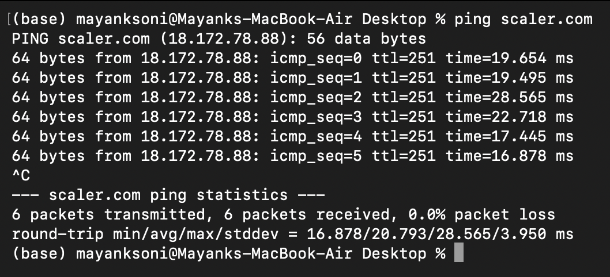
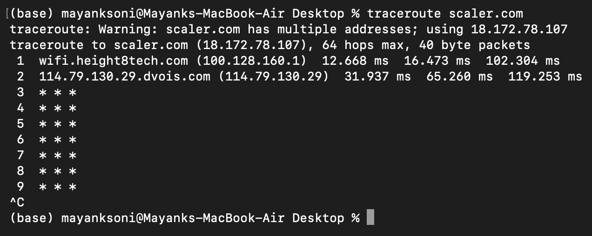
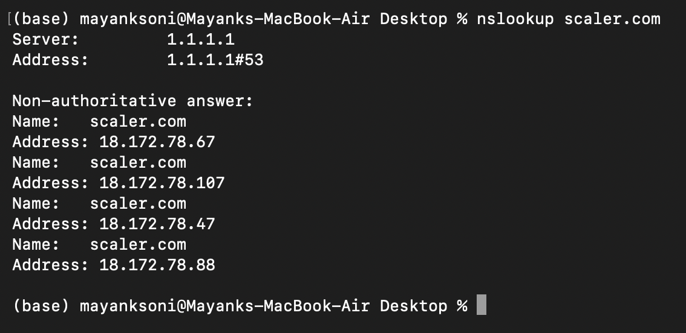
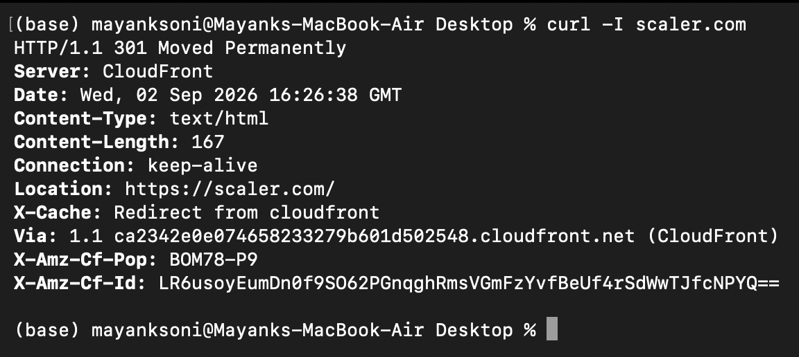
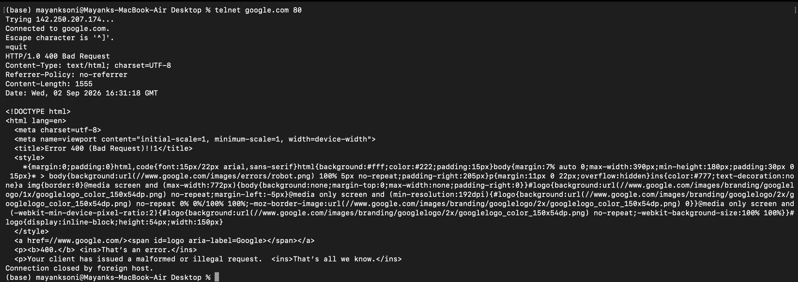
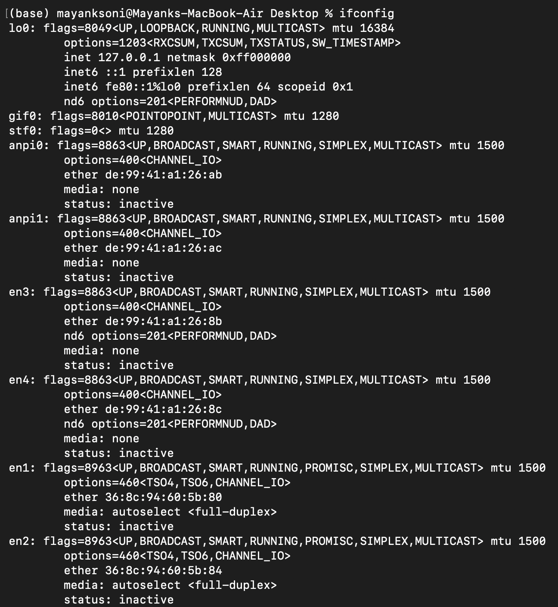
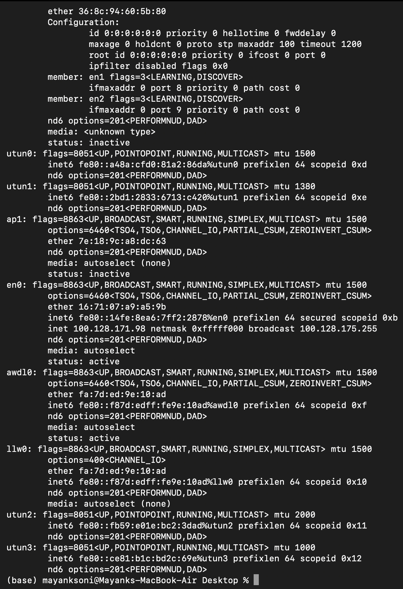
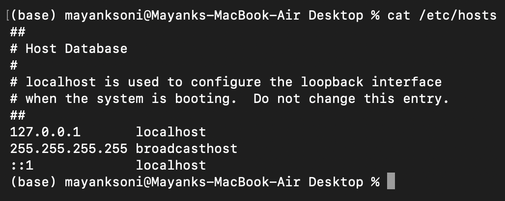

# Networking Homework Tasks

## `ping`

Tests whether the website is reachable or not.

---

## `traceroute`

Traces the path (hops) taken by the network packets.

---

## `nslookup`

Queries DNS servers to find the IP address(es) associated with a domain name.

---

## `curl -I`

Fetches websites headers and responses

---

## `telnet`

Tests if a specific port if open on the server

---

## `ifconfig`

IP Address Check

---

## `cat /etc/hosts`

Displays the local hosts file which maps hostnames to IP addresses, used for local DNS resolution.

