# Docker Homework Tasks

## Task: Hello World Applications

Create simple Hello World web applications using Docker for:
1. Node.js application 
2. Python application
3. Java application
4. Apache web server
5. React application
6. Nginx application

---

## 1. Node.js Application (`nodejs-app`)

### Build Image
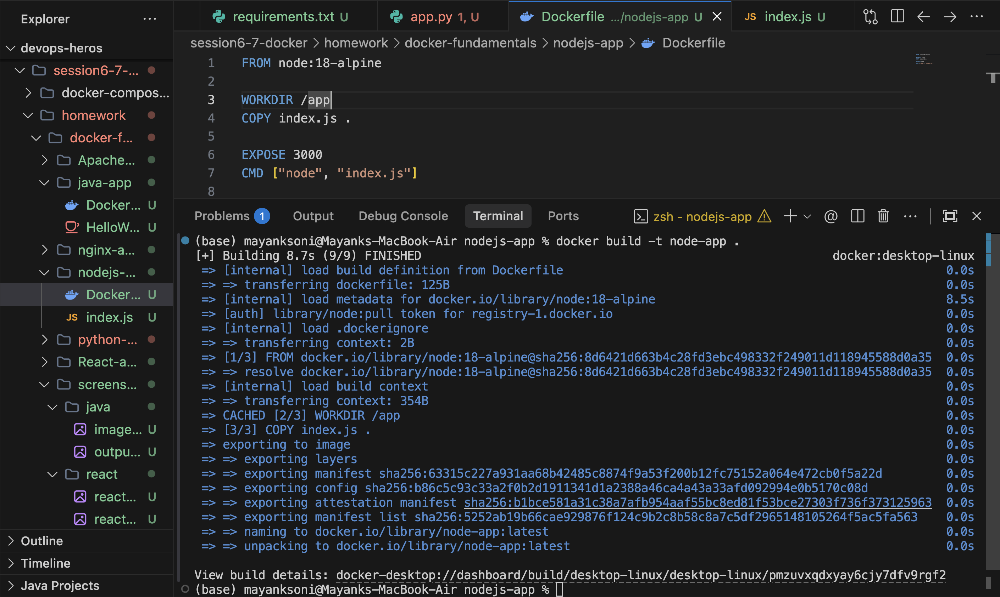

### Run Container
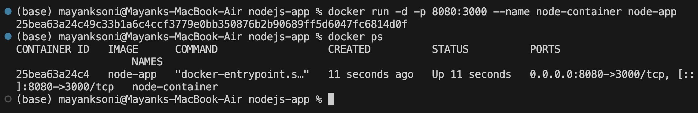

### Output Verification
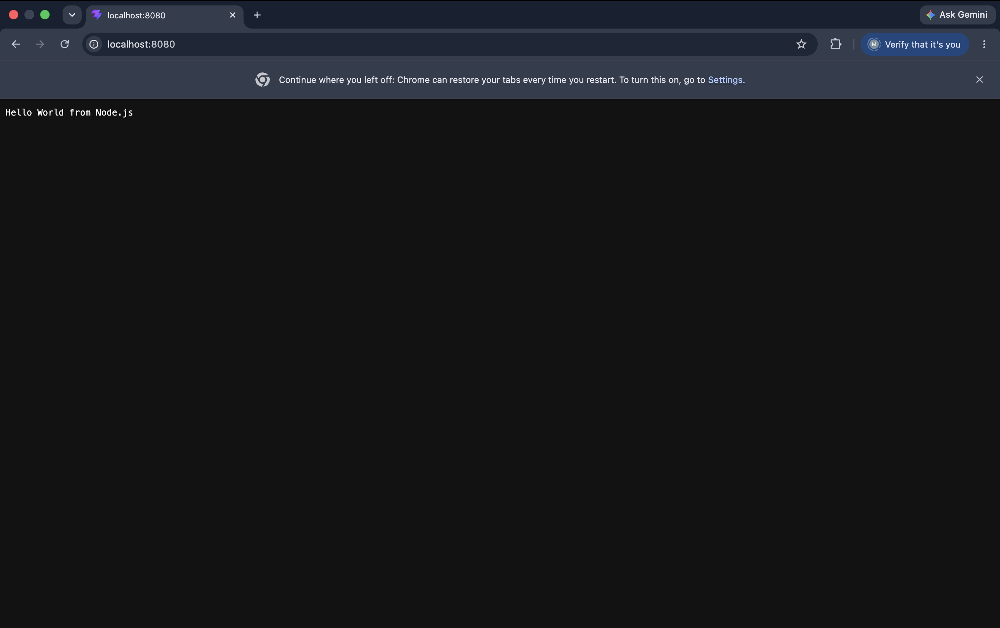

---

## 2. Python Application (`python-app`)

### Build Image
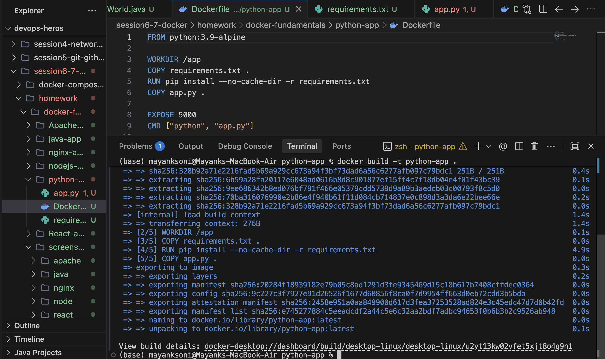

### Run Container
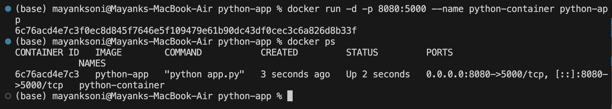

### Output Verification
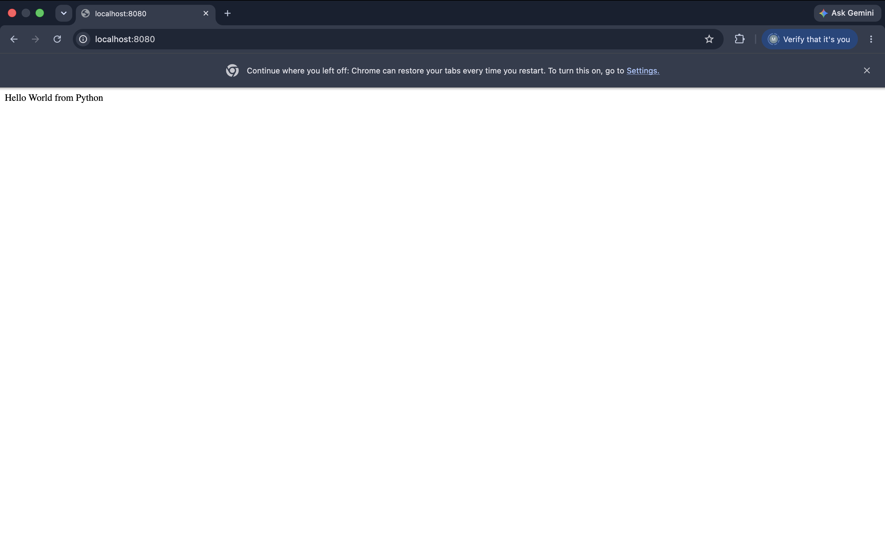

---

## 3. Java Application (`java-app`)

### Build Image
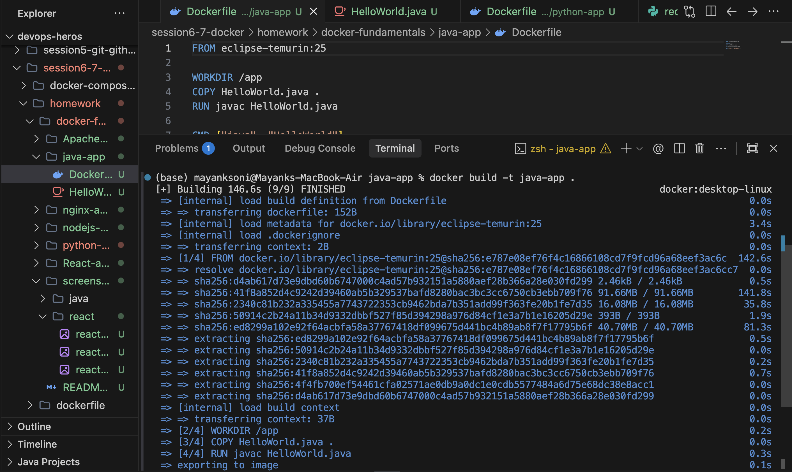

### Output Verification
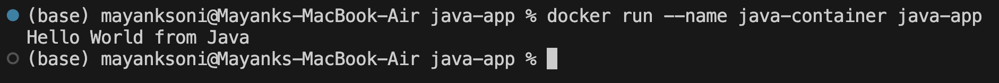

---

## 4. Apache Web Server (`Apache-app`)

### Build Image
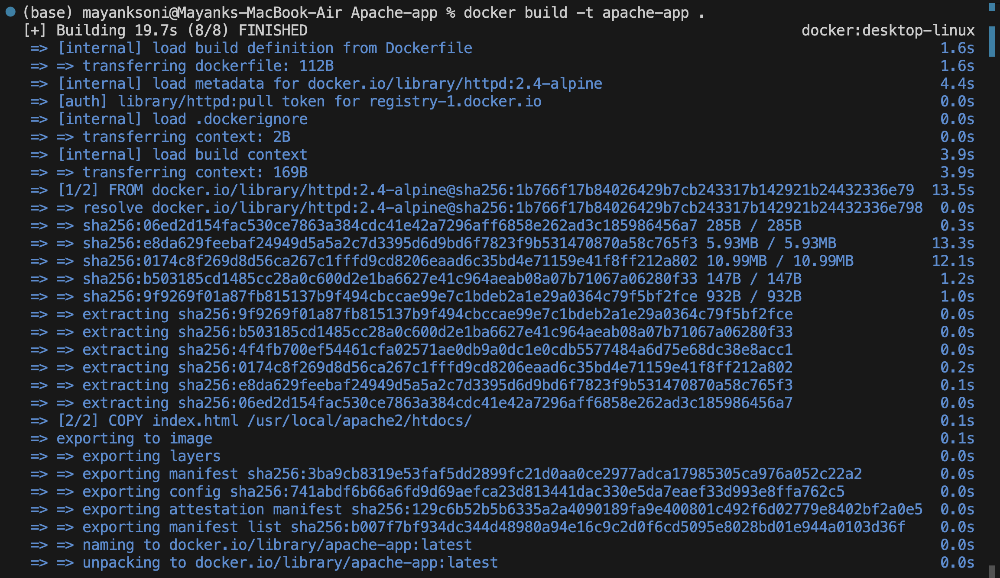

### Run Container
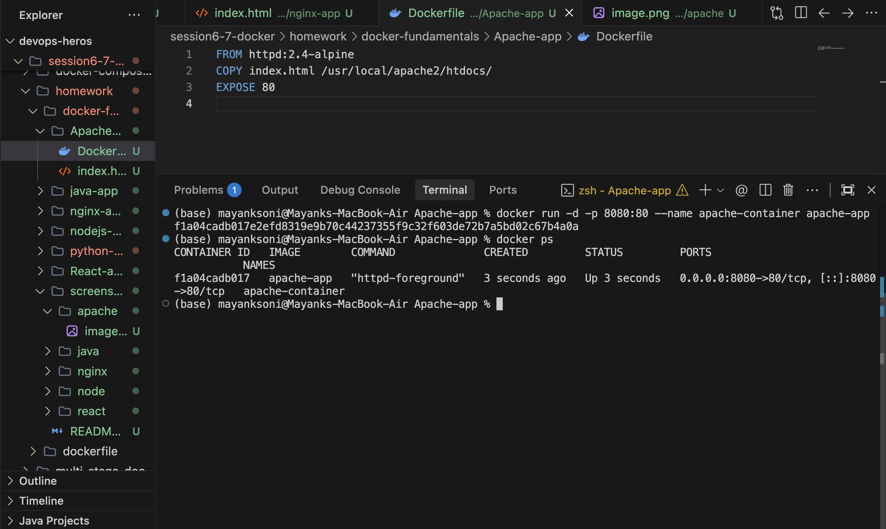

### Output Verification
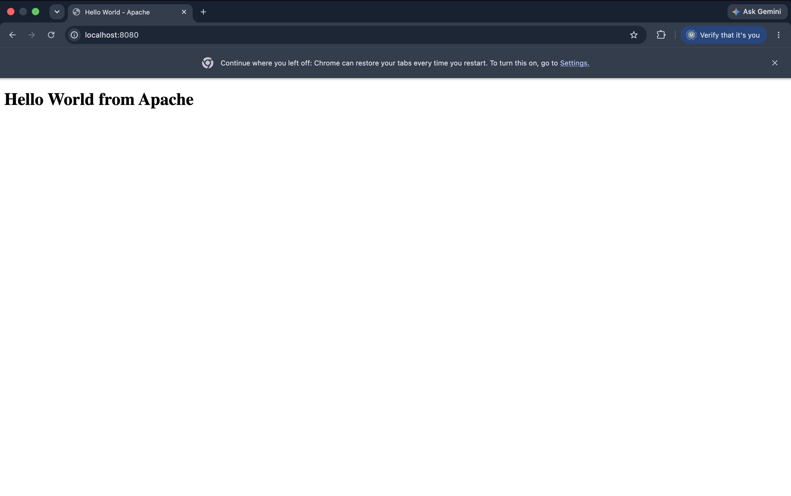

---

## 5. React Application (`React-app`)

### Build Image
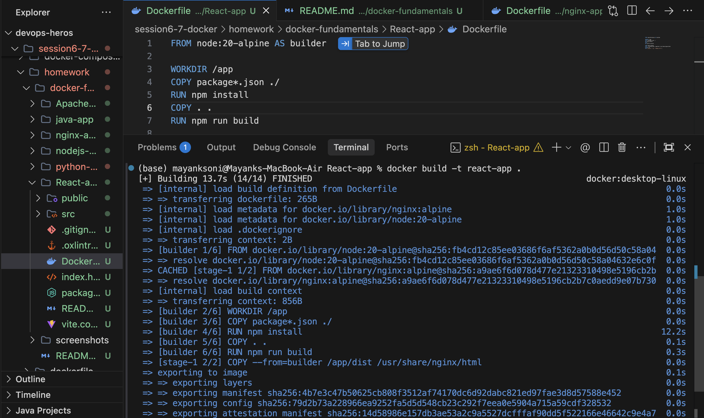

### Run Container
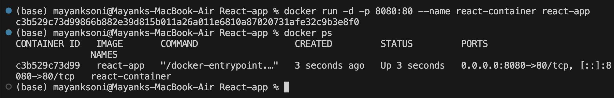

### Output Verification
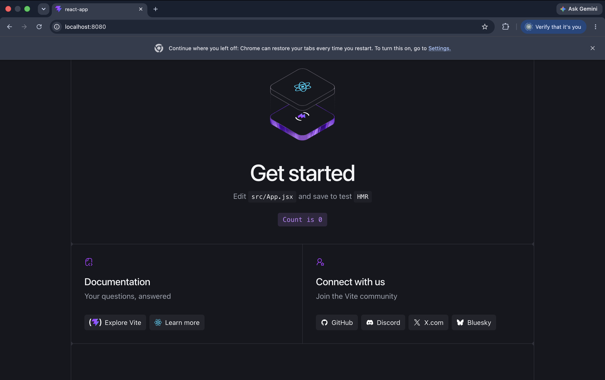

---

## 6. Nginx Application (`nginx-app`)

### Build Image
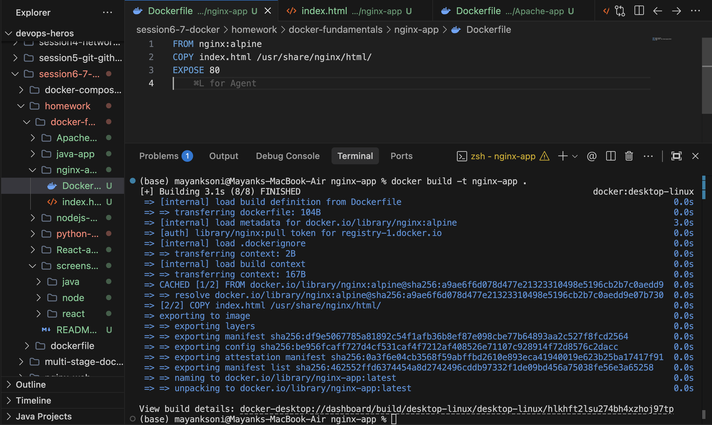

### Run Container
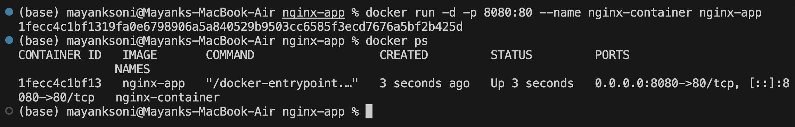

### Output Verification

