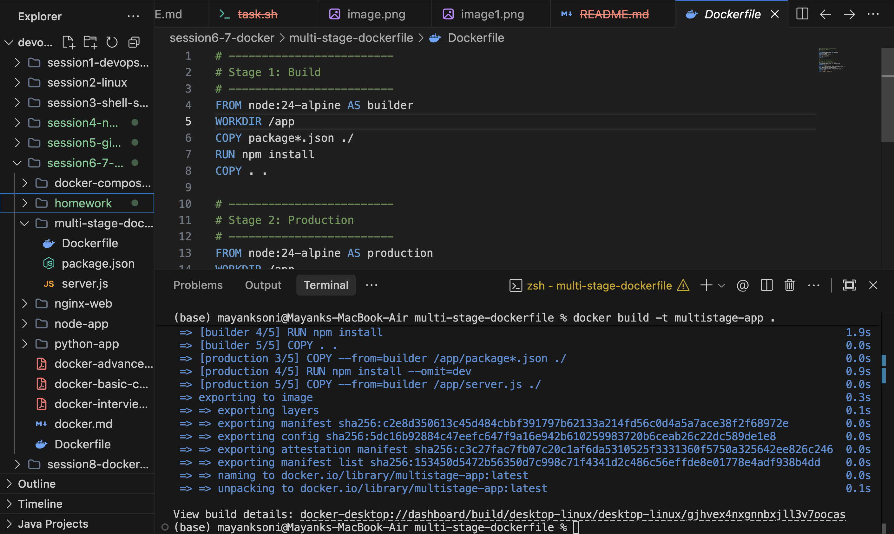
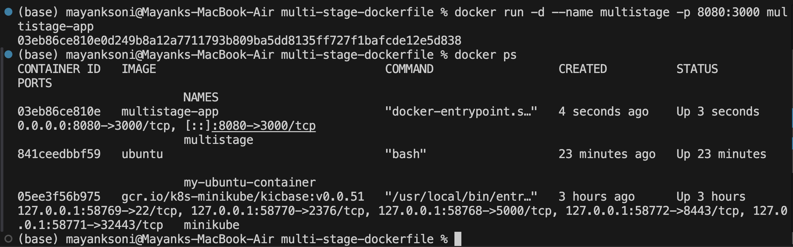
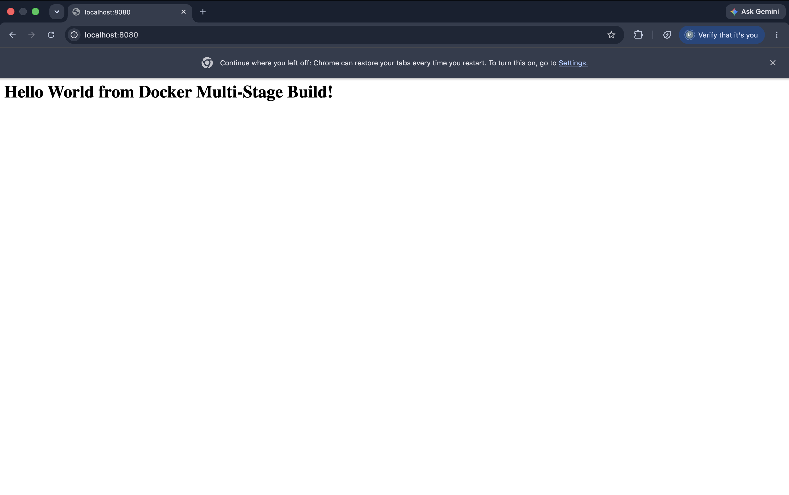
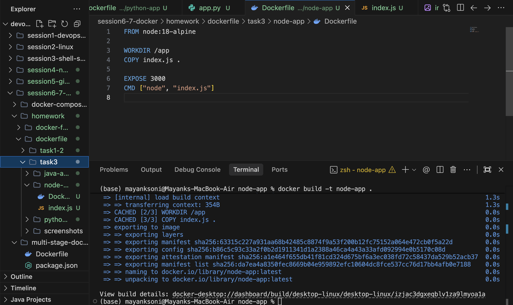
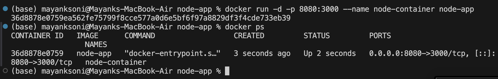
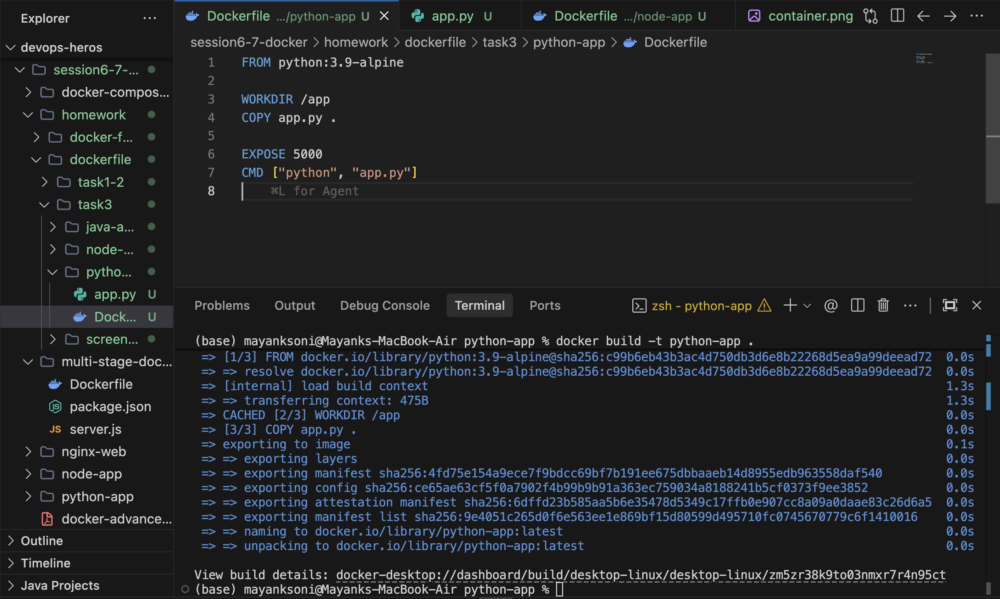
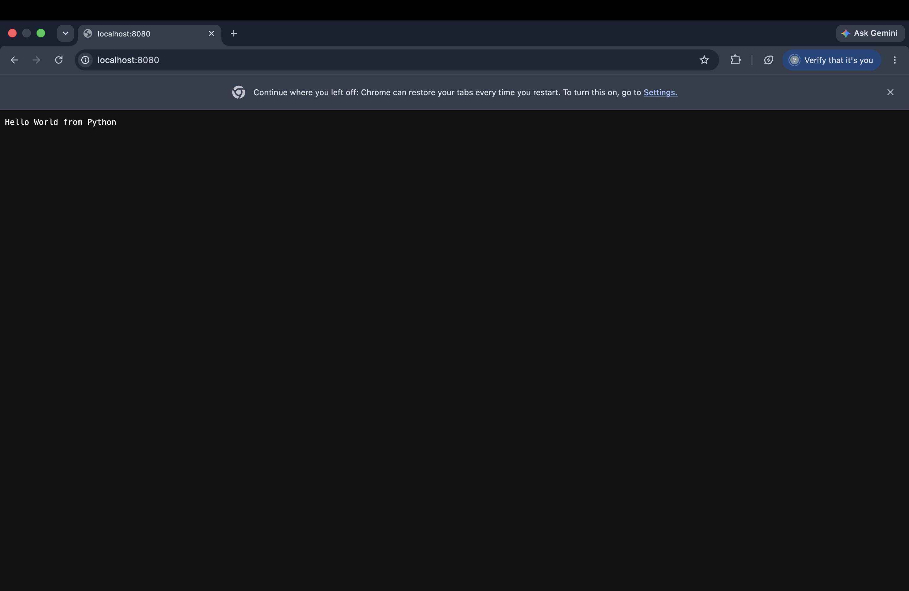
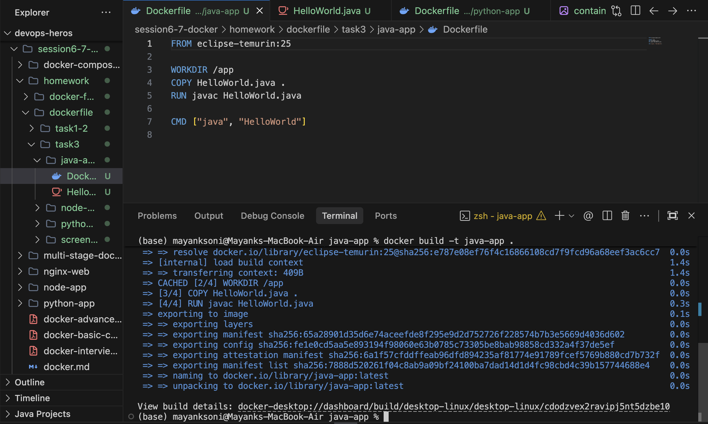
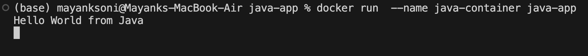

# Docker Multi-Stage Build Homework

**Name:** Mayank Soni
**Roll Number:** 24BCS10127

---

## Task 1 & 2: Multi-Stage Dockerfile Execution & Documentation

*Objective: Build and run a multi-stage Dockerfile, and verify the application runs on port 8080.*

### Build Image

### Run Container (Port 8080)

### Output Verification

---

## Task 3: Docker Application Deployment

*Objective: Deploy at least 3 different types of applications using Docker.*

### 1. Node.js Application

#### Build Image

#### Run Container

#### Output Verification

---

### 2. Python Application

#### Build Image

#### Output Verification

---

### 3. Java Application

#### Build Image

#### Output Verification

