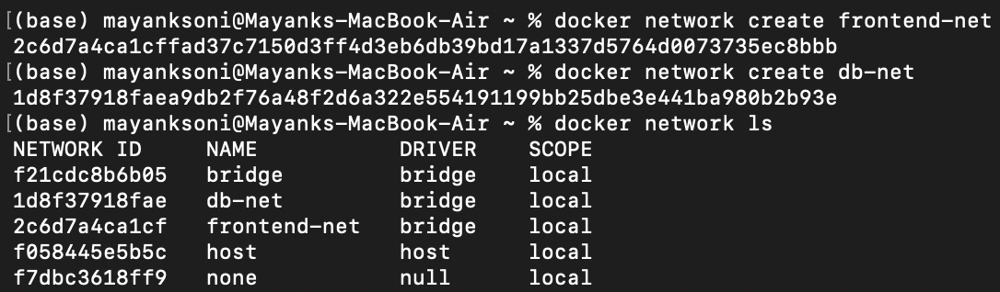
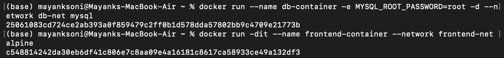
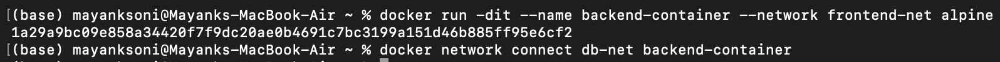
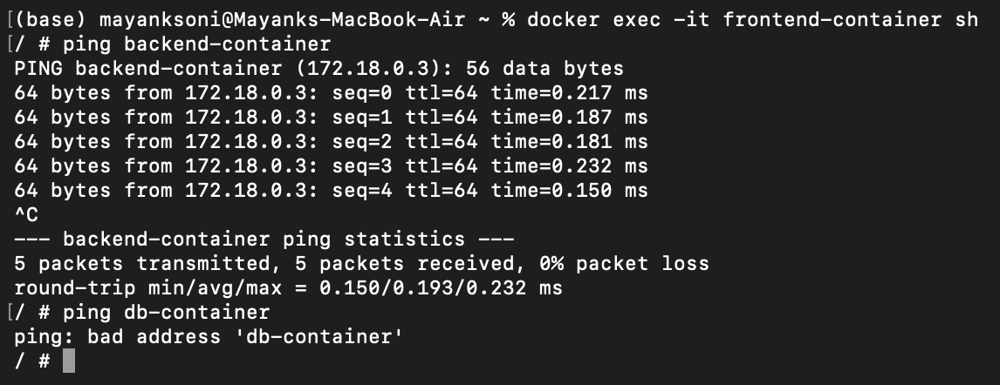
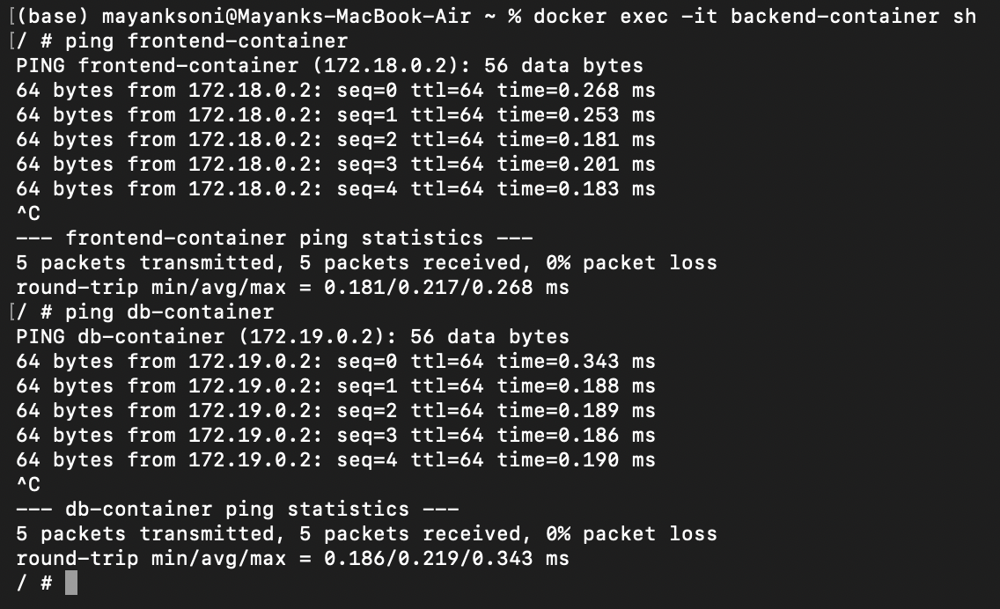
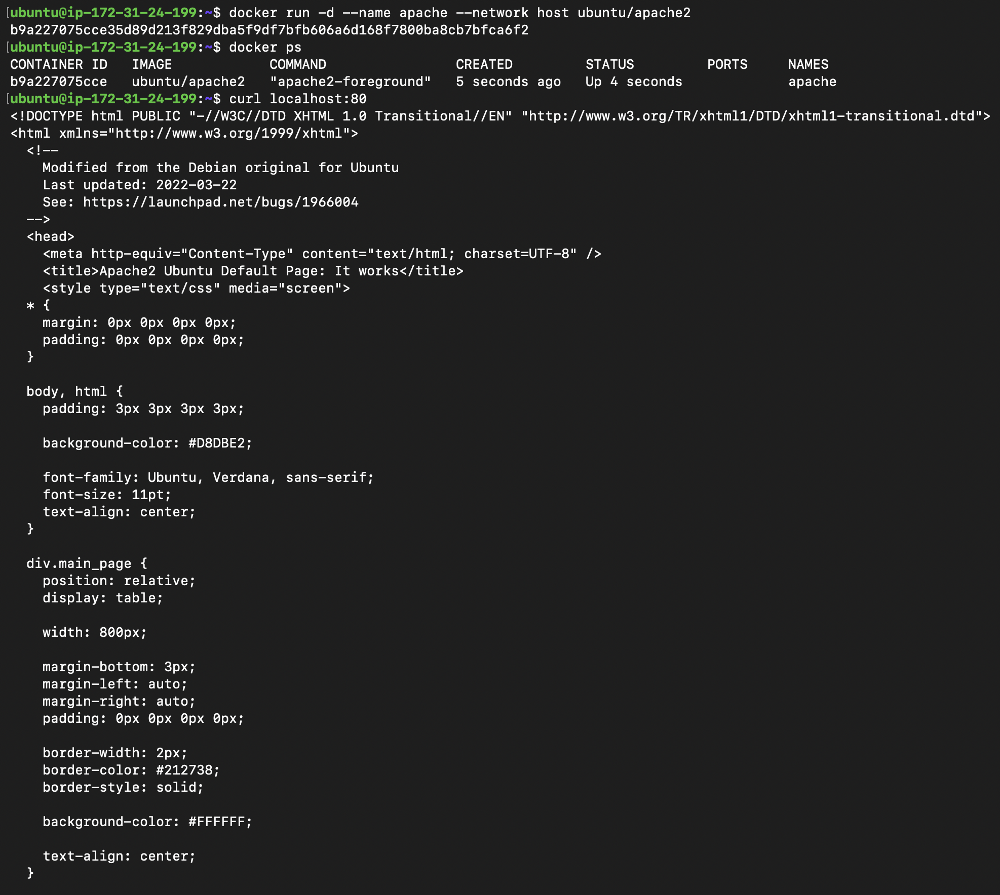
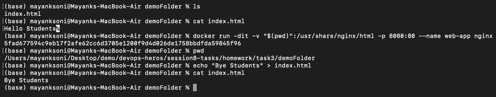

# Docker Networking & Volume Homework Tasks

## Task 1: Docker Container Networking

**Objective:** Create 3 containers (Frontend, Backend, Database), create 3 different Docker networks, add the backend container to 2 networks, and check connectivity between the containers.

### Network Creation

### Frontend Container

### Backend Container (connected to 2 networks)

### Connectivity Verification (Frontend -> Backend)

### Connectivity Verification (Backend -> Database)

---

## Task 2: Host Network

**Objective:** Pull the Apache2 image, create a container using the host network, and access the website directly on port 80.

---

## Task 3: Bind Mount

**Objective:** Create a local folder with an `index.html`, bind mount it to an Nginx container, access the website, modify the file, and verify the changes reflect without restarting the container.

### Bind Mount Commands & Execution

### Initial Website Access (`Hello students`)

### Modified Website Access (`Bye Students`)

---

## Task 4: Overlay Network

**Objective:** Research Docker overlay networks, understand their use cases, and how they work across multiple Docker hosts.

### Docker Overlay Networks

* **What is it?**
  Docker overlay network is a network that connects containers running on **different Docker hosts**. It makes containers on different machines communicate as if they are on the same network.

* **Use cases:**
  * Used in **Docker Swarm** for communication between services.
  * Useful for **distributed applications** running across multiple servers.
  * Allows containers on different hosts to communicate securely.

* **How does it work?**
  * An overlay network is created across multiple Docker hosts.
  * Docker uses **VXLAN encapsulation** to send container network traffic between hosts.
  * Each container gets an IP address from the overlay network.
  * Docker handles routing, so containers can communicate using their container IP/service name without needing to know which host they are running on.

**Example:**
If Container A is running on Host 1 and Container B is running on Host 2, both can be connected to the same overlay network and communicate directly, even though they are on different physical machines.
