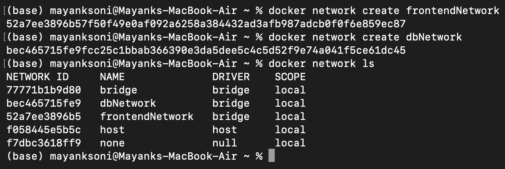
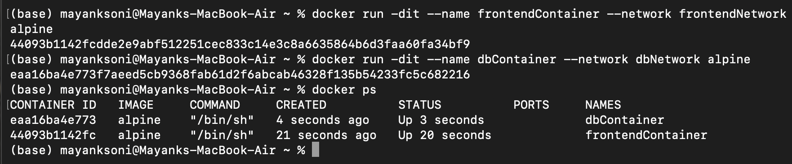
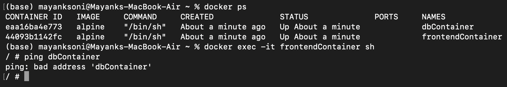
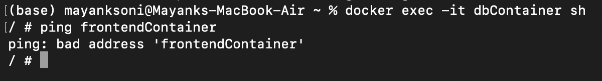
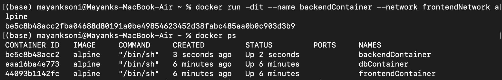
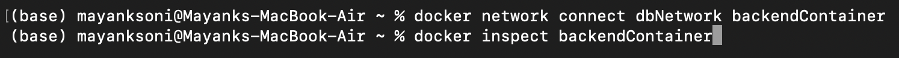
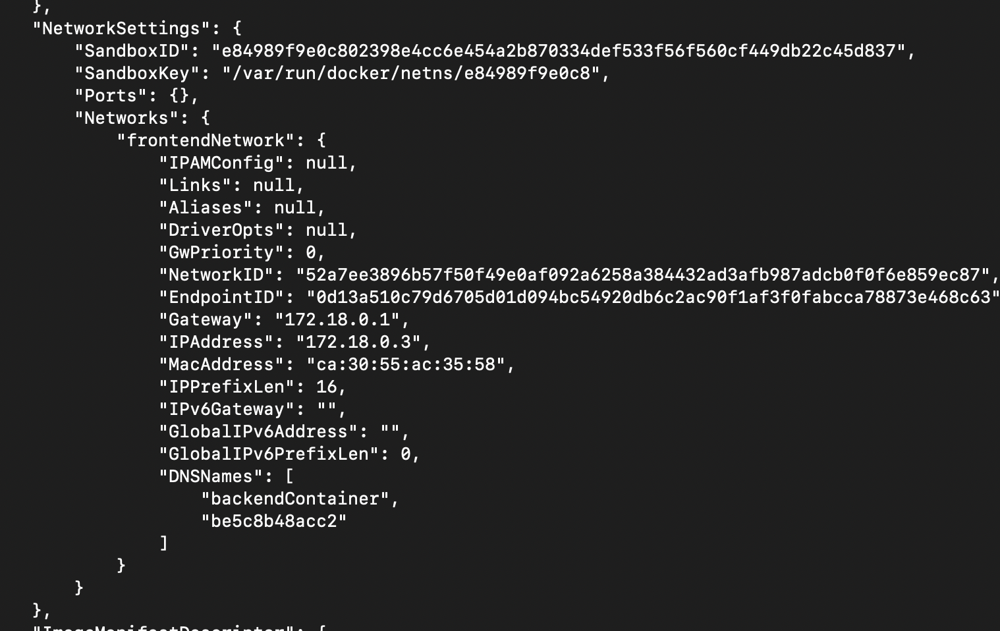
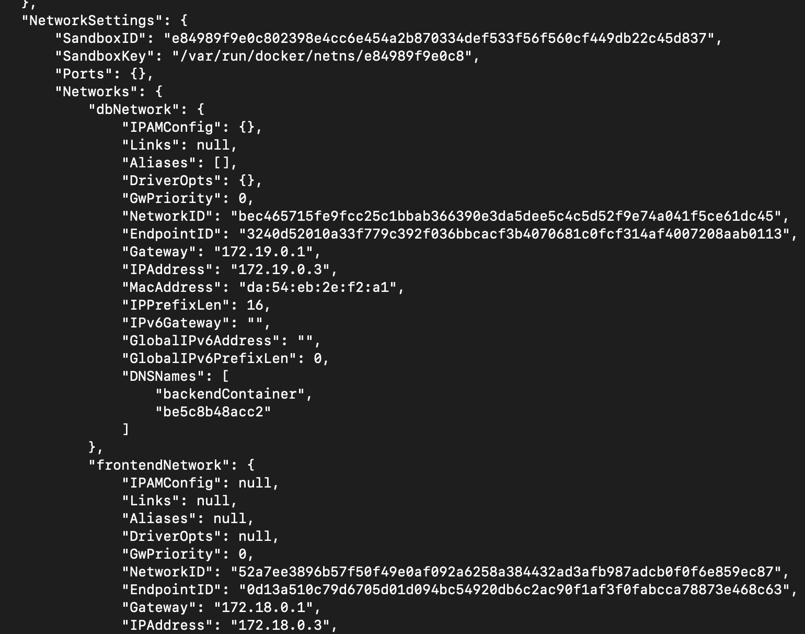
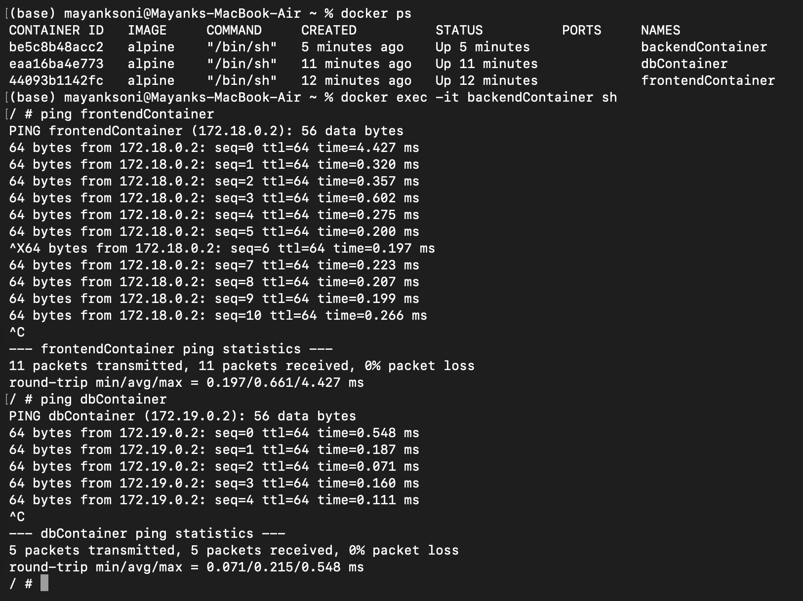
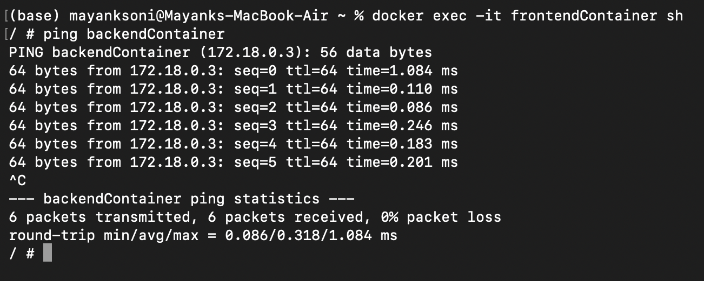

# Task 1

## Creating Custom Bridge Networks

Creating one container for the frontend and one for the database:

---

## Running Containers on Separate Networks

Running two Alpine containers (named frontendContainer and dbContainer), each attached their custom network:

---

## Verify Network Isolation

### Ping from frontendContainer → dbContainer

### Ping from dbContainer → frontendContainer

---

## Add backend Container to the Frontend Network

---

## Connecting backendContainer to Both Networks

### Inspect Frontend and Backend Containers

---

## Checking backendContainer's Connectivity

### From frontendContainer : ping backendContainer

