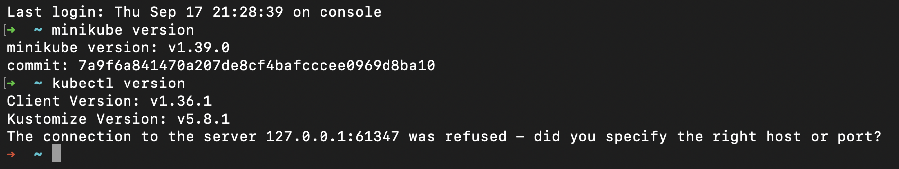

# Session 9: Kubernetes Architecture & Minikube Fundamentals

---

## Minikube Installation & Environment Setup

Setting up local Kubernetes development using `minikube` and `kubectl`.

```bash
# Verify minikube installation
minikube version

# Verify kubectl installation
kubectl version --client
```



---

## Minikube Cluster Lifecycle Execution

Managing local Kubernetes cluster lifecycle states (start, status, stop).

```bash
# Start the local Minikube cluster
minikube start

# Inspect cluster component health and status
minikube status

# Stop the local cluster cleanly
minikube stop
```


---

## Kubernetes Architecture & Core Components

According to the official Kubernetes architecture documentation, a cluster consists of a **Control Plane** (cluster management) and **Worker Nodes** (workload execution).

```text
              CONTROL PLANE
        ┌─────────────────────────┐
        │ API Server              │
        │ Scheduler               │
        │ Controller Manager      │
        │ etcd                    │
        └───────────┬─────────────┘
                    │
             Kubernetes API
                    │
        ┌───────────┴─────────────┐
        ↓                         ↓
  WORKER NODE 1             WORKER NODE 2
 ┌──────────────┐           ┌──────────────┐
 │ kubelet      │           │ kubelet      │
 │ runtime      │           │ runtime      │
 │ Pods         │           │ Pods         │
 │ kube-proxy   │           │ kube-proxy   │
 └──────────────┘           └──────────────┘
```

### 1. Control Plane (Master Node)

* **`kube-apiserver`**: Cluster entry point; exposes the Kubernetes API and validates all cluster requests.
* **`etcd`**: Distributed key-value store holding the complete cluster state and configuration data.
* **`kube-scheduler`**: Assigns newly created Pods to suitable worker nodes based on resource constraints.
* **`kube-controller-manager`**: Runs background controller loops to continuously align actual state with desired state.
* **`cloud-controller-manager`**: Interfaces with underlying cloud provider infrastructure (optional).

### 2. Worker Node

* **`kubelet`**: Primary node agent ensuring assigned Pods and containers are actually running and healthy.
* **`Container Runtime`**: Underlying software that executes containers (e.g., `containerd`, Docker).
* **`kube-proxy`**: Manages network rules and forwards Service traffic to destination Pods across nodes.

### Component Interaction Flow

```text
kubectl apply -f deployment.yaml
       │
       ▼
1. API Server receives request
       │
       ▼
2. Desired state saved in etcd
       │
       ▼
3. Scheduler selects optimal Worker Node
       │
       ▼
4. Kubelet on target Node fetches Pod spec
       │
       ▼
5. Container Runtime pulls image and starts containers
```
